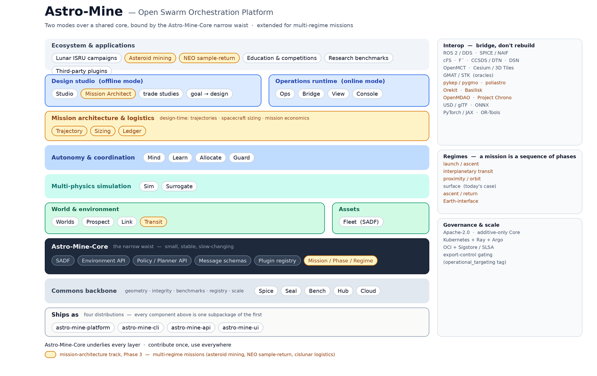

# **Swarm Exploration & ISRU Orchestrator**

***Open-Source Project — Product Envisioning & Architecture***

*Working platform name: **Astro-Mine**  ·  Open Swarm Orchestration Platform*

## 1. Executive summary

Astro-Mine is an open-source platform for designing, simulating, and ultimately operating large heterogeneous robotic swarms — orbiters, landers, rovers, hoppers, excavators, haulers, and ISRU plants — for exploration and in-situ resource utilization on the Moon, Mars, and small bodies. The ambition is not a single application but a commons: the shared simulation, benchmark, and orchestration substrate that planetary-swarm robotics is built on, the way ROS and Gazebo became the substrate for terrestrial robotics and Gymnasium became the substrate for reinforcement learning. While the anchor use case is surface ISRU on a single body, the platform's scope spans complete multi-regime *missions* — launch, interplanetary transit, body-proximity, surface, ascent, and return — unified by a Mission/Phase model (§4.8, §10), so the same commons that designs a lunar prospecting swarm can architect an asteroid-mining or sample-return campaign end to end.

The strategic bet is deliberate. The market does not exist yet — and as an open-source project, that same property is its greatest strength: open source is the right vehicle for pre-commercial infrastructure, because it lets a whole field share the cost of building the tools before any one company can justify the investment — and whoever hosts the commons sets the standard the eventual industry inherits.

This document performs the full envisioning: the component architecture, how it ships, who each part serves, how they interconnect, the technologies to leverage, the research that must be done, the hardest engineering problems, and the platform strategy that turns a toolkit into an ecosystem.

## 2. Product strategy & positioning

#### What it is

A modular, plugin-based platform spanning two modes over one shared core. The design mode lets a user specify a goal — “produce 10 tonnes of water per month from this crater” — and explore swarm compositions, orbital infrastructure, and cooperative policies in high-fidelity simulation. The operate mode runs a validated campaign, first as a digital-twin shadow of reality and eventually commanding real assets through a hardware abstraction layer. A benchmark-and-hub backbone makes results reproducible and shareable. Beyond a single surface campaign, the design mode also performs *mission architecture* — sequencing a mission across regimes and co-exploring launch vehicles and reusable in-orbit assets, interplanetary trajectories, spacecraft and payload sizing, and mission economics (§4.8).

#### Who it is for

- **Researchers** in multi-agent autonomy, planetary robotics, terramechanics, and planetary science — the earliest and largest contributor base, drawn by benchmarks and shared environments.
- **Mission designers** at agencies and primes running Phase-0/A concept studies for lunar and Martian surface campaigns.
- **Mission & systems engineers, astrodynamicists, and resource economists** architecting multi-regime missions — transfers, fleet sizing, and mission economics.
- **NewSpace and ISRU startups** that cannot afford to build a full simulation and autonomy stack from scratch.
- **Educators and students** who need an accessible, runnable platform for space-robotics coursework and competitions.
- **Operators (later)** of real surface fleets, once missions reach the scale where manual scripting no longer suffices.

#### Positioning

Astro-Mine is to planetary-swarm robotics what ROS is to robots and what a benchmark suite is to a learning field: not the thing you sell, but the thing everyone builds on. The commercial layer — proprietary policies, mission-specific tuning, managed cloud, support — sits above the open core and is where companies (including a future sponsor) capture value, exactly as Red Hat, the ROS ecosystem vendors, and the Hugging Face model economy do.

## 3. Architecture overview

Astro-Mine is organized as a layered stack. Environment and asset models describe the place and the robots; a multi-physics engine simulates them; an autonomy layer decides and coordinates; the design studio and operations runtime are the two user-facing modes; and a benchmark-and-hub backbone makes everything reproducible and shareable. Binding it together is Astro-Mine-Core — the “narrow waist” of stable interfaces that every layer and every third-party plugin speaks to.

*Figure 1. Astro-Mine layered architecture. Two modes (design / operate) over a shared simulation and autonomy core, bound by the Astro-Mine-Core narrow-waist interfaces and fed by an open benchmark-and-hub backbone. Amber marks the multi-regime mission-architecture track (§4.8): the Mission architecture & logistics layer (Trajectory · Sizing · Ledger), Astro-Mine-Transit, and the Mission/Phase/Regime model in Core. The band across the bottom is how the whole stack ships — four distributions (§4.9).*

The architectural principle is a thin, stable core with thick, swappable edges. Astro-Mine-Core is small and changes slowly; everything valuable — worlds, robots, planners, policies, ISRU processes — is a plugin that can be contributed, versioned, and replaced without touching the core. That is what converts a toolkit into a platform.

**The layers are a design boundary, not a packaging boundary.** Every Python component ships as a subpackage of **one** distribution, `astro-mine-platform` — one wheel, importable as `astro_mine.<component>`. Three sibling distributions carry the surfaces that are not the library: the command line, the REST services, and the browser front end (§4.9). This is a deliberate correction of an earlier repo-per-package structure, and it raises rather than lowers the stakes on the waist: with no repository walls between components, nothing in the build stops one from reaching past Core into another's internals. The waist now holds on its own merits — enforced by schema contracts, wire-compatibility checks, and layering tests inside a single tree rather than by the friction of a cross-repo dependency.

The stack is unified by one further abstraction: a **Mission** — an ordered set of **Phases**, each in a **Regime** (launch, interplanetary transit, body-proximity, surface, ascent/return, Earth-interface). A single-body surface campaign is simply the one-phase case, so this generalization is additive: it lets the same components design and operate complete multi-regime missions without disturbing existing scenarios. It introduces one new component layer — **mission architecture & logistics** (§4.8) — and a deep-space environment component, detailed in the [architecture documentation](../architecture/system.md) and [mission-model.md](../architecture/mission-model.md).

## 4. Component catalog

The components below are grouped by layer. Names are illustrative but chosen to read as a real ecosystem. Each is independently useful, which matters: contributors adopt one component for their own problem long before anyone runs the whole stack. Each is a subpackage of the one platform distribution, imported as `astro_mine.<name>`; §4.9 describes how the whole thing ships.

### 4.1 World & environment models

The substrate: where the swarm operates and what is in the ground. These components turn real mission data (lunar and Martian elevation models, illumination, resource priors) into simulatable worlds.

| **Component** | **What it does** | **Primary users** | **How it's used** |
|---|---|---|---|
| **Astro-Mine-Worlds** | Parameterized celestial-body environments: gravity, terrain from real DEMs, regolith mechanics, surface thermal, lighting and shadowing (including permanently shadowed regions), and dust. | Planetary scientists, simulation builders | Select and configure a world (e.g., the Shackleton crater rim) as the physical substrate for any scenario. |
| **Astro-Mine-Prospect** | Probabilistic resource-field models — water ice, mineral concentration — expressed as geostatistical distributions with explicit uncertainty rather than single guesses. | ISRU planners, planetary scientists | Defines what resources exist and how uncertain they are, which drives prospecting, sampling, and active-perception tasks. |
| **Astro-Mine-Link** | Communications environment: line-of-sight, relay geometry, latency, bandwidth, and Earth-link windows via relay orbiters or deep-space ground stations. | Comms and operations engineers | Models when and where agents can talk to each other and to Earth — the constraint that makes coordination hard. |
| **Astro-Mine-Transit** | Interplanetary / free-space dynamical and hazard environment between bodies: n-body ephemerides and gravity, radiation, thermal/eclipse, and micrometeoroid models for cruise and station-keeping. | Astrodynamicists, mission & systems engineers | Provides the physical substrate for the transit and proximity regimes — what Worlds is to a body, Transit is to the space between them. |

### 4.2 Asset & agent models

The robots. A shared description format lets the community contribute new vehicles without forking the simulator.

| **Component** | **What it does** | **Primary users** | **How it's used** |
|---|---|---|---|
| **Astro-Mine-Fleet** | A library of parameterizable asset models — orbiters, landers, rovers, hoppers/flyers, excavators, haulers, manipulators, ISRU plants — each in the Swarm Asset Description Format (SADF): geometry, dynamics, power/thermal budgets, sensors, comms, and declared autonomy capabilities. | Roboticists, mission designers | Assemble the menu of available robots for a campaign; contribute new vehicle types as self-contained packages. |

### 4.3 Multi-physics simulation

The beating heart. One engine must couple orbital dynamics, surface mobility, manipulation and excavation, power and thermal behavior, and sensor models — and must run at swarm scale, which forces a multi-fidelity design.

| **Component** | **What it does** | **Primary users** | **How it's used** |
|---|---|---|---|
| **Astro-Mine-Sim** | The multi-physics engine and scenario runtime: couples orbital propagation, terramechanics (wheel/soil and contact), manipulation and granular excavation, power/thermal evolution, and sensor simulation, with a multi-fidelity scheduler that trades accuracy for speed per task. | Everyone — it is the execution substrate | Runs any scenario; high fidelity for validation, lower fidelity for interactive design and large-scale training. |
| **Astro-Mine-Surrogate** | Learned, fast surrogates for the most expensive physics — especially granular/excavation contact — with explicit error tracking against the high-fidelity engine. | ML researchers, anyone running large sweeps | Swapped in to make swarm-scale training and interactive iteration tractable; validated periodically against ground-truth physics. |

### 4.4 Autonomy & coordination

Where the genuine novelty lives: getting tens to hundreds of heterogeneous robots to cooperate under partial observability, intermittent communications, and tight power and terrain constraints — without becoming brittle.

| **Component** | **What it does** | **Primary users** | **How it's used** |
|---|---|---|---|
| **Astro-Mine-Mind** | Hierarchical autonomy framework: a mission planner assigns roles and regions, per-agent task-and-motion planners turn roles into actions, and local controllers execute. Behavior trees and pluggable planners throughout. | Autonomy researchers, mission designers | Compose how the swarm decides and acts; replace any layer (e.g., a new global planner) without rewriting the rest. |
| **Astro-Mine-Learn** | Multi-agent reinforcement-learning toolkit: PettingZoo-style environments, baselines, curricula, and training infrastructure built for partial observability and comms-limited cooperation. | ML and RL researchers | Train cooperative policies at scale and publish them to the hub for others to reuse and beat. |
| **Astro-Mine-Allocate** | Heterogeneous multi-robot task allocation and scheduling under coupled power, comms-window, and terrain constraints, combining exact solvers (CP-SAT / OR-Tools) with learned heuristics. | Planning researchers, mission designers | Decides who does what, when, and where — the combinatorial core of swarm coordination. |
| **Astro-Mine-Guard** | Runtime assurance: safety shields, monitors, and fallback behaviors that wrap learned or planned policies so hard constraints (collision, power floors, keep-out zones) cannot be violated. A `SafetySpec` is the declarative, signed statement of what must never happen, and Guard owns it. | Autonomy and safety engineers | Wrap any policy to make it deployable; provides the assurance story that learned methods otherwise lack. |

### 4.5 Design studio (offline mode)

| **Component** | **What it does** | **Primary users** | **How it's used** |
|---|---|---|---|
| **Astro-Mine-Studio** | The design front door: goal-in, design-out. Specify an objective and available assets; the studio proposes swarm composition, orbital infrastructure, and candidate policies, runs trade studies, and authors campaigns and contingencies. Intent capture can be LLM-assisted, reusing the “intent-to-mission” idea from the Generative Mission Architect concept. | Mission designers, startups, educators | The primary authoring environment for designing and comparing campaign options before anything is committed. |

### 4.6 Operations runtime (online mode)

The threshold from simulation to reality. The same plans that were validated in sim drive a digital-twin shadow, then real hardware through an abstraction layer.

| **Component** | **What it does** | **Primary users** | **How it's used** |
|---|---|---|---|
| **Astro-Mine-Ops** | Orchestration runtime: fleet-wide state estimation, plan execution, monitoring, replanning, and anomaly handling, with a human-in-the-loop supervisory console and a digital-twin shadow that validates plans before they are committed. | Operators, mission ops teams | Actually runs a swarm — against the simulator today, against real assets later — with supervisory override and explanation. |
| **Astro-Mine-Bridge** | Hardware and flight-software abstraction: adapters to ROS 2, NASA core Flight System (cFS), F´, and CCSDS, so identical plans drive either the simulator or real flight hardware. | Flight-software engineers, integrators | Connects Astro-Mine to real robots and flight stacks without changing the layers above it. |
| **Astro-Mine-View** | Visualization and telemetry: 3D geospatial views (Cesium / 3D Tiles), OpenMCT integration, swarm dashboards, and plan explanations. | Operators, stakeholders, educators | See and understand what the swarm is doing and why — for operations, demos, and teaching. |
| **Astro-Mine-Console** | The single GUI shell: one front door to every component, plus the platform design system it renders with. | Everyone who would rather click than type | One application spans every component, so no component ships an app of its own. |

### 4.7 Commons backbone & platform infrastructure

The machinery that makes Astro-Mine a shared standard rather than a pile of code: the interfaces, the benchmarks, the hub, and the scale-out infrastructure.

| **Component** | **What it does** | **Primary users** | **How it's used** |
|---|---|---|---|
| **Astro-Mine-Core** | The narrow waist: the Swarm Asset Description Format, the environment and policy/planner APIs, the message schemas (including the plan and objective vocabularies), and the plugin registry. Small, stable, slow-changing. | All developers | The contract every layer and plugin speaks to; the single most important component to design well. |
| **Astro-Mine-Spice** | The SPICE-backed realization of Core's frame, epoch, and geometry vocabulary — positions, rotations, and topocentric site geometry, and nothing beyond that. | Anyone resolving a frame or an epoch | One SPICE implementation the whole platform shares, rather than a copy per component (§9.6). |
| **Astro-Mine-Seal** | Artifact integrity: signing, verification, SLSA provenance, SBOM generation, and verify-twice orchestration over Core's signature envelope. | Publishers and verifiers | One signer and one verifier for every producer, so a crypto change can never silently accept a bad artifact (§9.6). |
| **Astro-Mine-Bench** | Benchmark suite and scenario zoo: named challenge scenarios (e.g., polar water prospecting), standard metrics, public leaderboards, and a reproducibility harness. | Researchers, the whole community | Compare methods on shared tasks — the academic flywheel that drives adoption and contribution. |
| **Astro-Mine-Hub** | Registry for sharing and discovering trained policies, worlds, assets, and plugins, in the spirit of a model hub. | Everyone | Distribute and reuse community contributions; the network that compounds the project's value. |
| **Astro-Mine-Cloud** | Distributed simulation orchestration on Kubernetes and Ray for large-scale parameter sweeps and training. | Power users, organizations | Run thousands of simulations in parallel for design optimization and policy training. |

### 4.8 Mission architecture & logistics

Design-time engines for complete multi-regime missions: how to get there, what to fly, and whether it pays. They run upstream of the swarm-design loop and are orchestrated by Astro-Mine-Studio's Mission Architect mode.

| **Component** | **What it does** | **Primary users** | **How it's used** |
|---|---|---|---|
| **Astro-Mine-Trajectory** | Design-time trajectory & maneuver optimization across regimes — launch injection, transfers, rendezvous, proximity, and return; launch/return window scans; Δv/time-of-flight trades. Produces descriptive reference trajectories, not executable guidance. | Astrodynamicists, mission designers | Find feasible transfers and budgets that constrain fleet sizing and task allocation. |
| **Astro-Mine-Sizing** | Spacecraft & payload systems-engineering sizing: mass/power/propellant/staging budgets, payload packing, launch manifesting, and reusable-in-orbit-asset accounting. | Mission & systems engineers | Answer "what spacecraft, what payload, and what can I reuse in orbit" given a mission's Δv and throughput needs. |
| **Astro-Mine-Ledger** | Open techno-economic & logistics modeling — cost, value, and risk under explicit uncertainty — the mission-level objective/value function. Proprietary cost data stays a commercial plugin. | Mission economists, designers | Provide the value function that mission trade studies optimize against. |

These engines depend only on additive Astro-Mine-Core schema hooks (the Mission/Phase/Regime model); existing components are *extended, not replaced* — for small bodies, microgravity, deep-space comms, propulsion, and multi-phase operations. The track is **opt-in and must not gate the lunar MVP**: its only early obligation is reserving the additive Core hooks, and the implementations land in Phase 3 (§10). See [mission-model.md](../architecture/mission-model.md) for the model and the per-component extension list.

### 4.9 How it ships — the four distributions

The component catalog above is a map of *design* boundaries. It is not a map of published artifacts, and conflating the two is how a platform ends up with twenty release processes and one user who can install it. Astro-Mine publishes **four** things:

| **Distribution** | **What it is** | **Who installs it** |
|---|---|---|
| **`astro-mine-platform`** | One Python wheel carrying every component of §4.1–4.8 as `astro_mine.<name>`. It is a **library** and ships no commands. | anyone using the platform from Python |
| **`astro-mine-cli`** | The one executable, `astro-mine`, under one grammar: `astro-mine <component> <verb>`. Depends on the platform; installing it installs everything. | anyone using the platform from a terminal |
| **`astro-mine-api`** | The REST services — the Hub registry API, the Studio API, Cloud's submission service, and the Bench leaderboard — behind one deployable. | whoever runs a hosted tier |
| **`astro-mine-ui`** | The browser front end: the console shell, its surface contract, the design system, the visualization library, and the per-component surfaces, published under the `@astro-mine` npm scope. | whoever serves the GUI |

Three properties this buys, each of which was leaking before:

- **One install, one version.** A user installs the CLI and has the whole platform at a single, self-consistent version. There is no dependency matrix between components and nothing to pin, because there is nothing to skew.
- **The library has no user interface.** Argument parsing, help text, exit codes, and output formatting are a different concern from resource fields and rigid-body physics. With every command in one distribution, the platform's only boundary is its Python API — and "is this exported?" acquires a real answer.
- **A surface is decided once.** Help text, `--json` shape, REST conventions, and GUI layout used to be decided independently per component, as many times as there were components. Each now has exactly one home.

What it costs, stated plainly: one base dependency set is the union of every component's, so installing the platform brings SPICE, PyTorch, OR-Tools, and USD whether or not a given user needs them. Heavy *optional* stacks (Ray, MuJoCo, ONNX runtimes) stay behind component-prefixed extras, and the local tier still runs on one workstation with no services and no accounts — which is the property that actually had to survive.

## 5. How the pieces connect into one ecosystem

The components form two loops — a design/training loop and an operations loop — that share the same simulation core and the same Astro-Mine-Core interfaces, with the benchmark-and-hub backbone capturing and redistributing everything produced.

#### The design & training loop

Astro-Mine-Worlds, Astro-Mine-Prospect, and Astro-Mine-Link describe the place; Astro-Mine-Fleet describes the robots. Astro-Mine-Sim (accelerated by Astro-Mine-Surrogate) simulates them. Astro-Mine-Learn and Astro-Mine-Mind train and compose policies against that simulation; Astro-Mine-Allocate solves the assignment problem; Astro-Mine-Guard wraps the result for safety. Astro-Mine-Studio sits on top, orchestrating this loop to turn a stated goal into a candidate design. Astro-Mine-Bench scores it; Astro-Mine-Hub stores and shares it. The whole loop runs at scale on Astro-Mine-Cloud.

#### The operations loop

A validated design moves to Astro-Mine-Ops, which executes and monitors it. A digital-twin instance of Astro-Mine-Sim runs in shadow, predicting outcomes and vetting each replan before it is committed. Astro-Mine-Bridge translates committed plans into commands for real hardware (or the simulator); telemetry flows back up through Astro-Mine-View for human supervision. Anomalies trigger replanning back through Astro-Mine-Mind and Astro-Mine-Allocate — the same components used in design, now closing the loop in operations.

#### The connective tissue

Every arrow in both loops crosses a Astro-Mine-Core interface. A new world, robot, planner, or ISRU process is contributed once, against those interfaces, and is immediately usable everywhere — in design, in training, in operations, and in benchmarks. That single property — contribute once, use everywhere — is what makes the collection an ecosystem rather than a bundle.

It is worth being precise about what enforces it now that the components share one distribution. An arrow crossing a Core interface used to be, in part, a fact about the build: reaching into another component's internals meant declaring a dependency on another package. That friction is gone. What remains is stronger where it counts and weaker where it does not: schemas are addressed by published identifier and resolved through Core's registry, wire compatibility is machine-checked on every change, the schema set has a content address a benchmark can pin, and layering is asserted by test rather than by packaging. A contributor can still write a shortcut past the waist; CI is what refuses it.

## 6. Technologies to leverage

Astro-Mine should integrate aggressively and reinvent as little as possible. The mandate is to be the planetary-swarm layer on top of mature open foundations, not to rebuild robotics middleware or physics engines.

#### Simulation & physics

- Physics and rendering: NVIDIA Isaac Sim / Omniverse (GPU-scale robotics sim), Gazebo, MuJoCo and Brax (fast, differentiable contact), Drake (contact-rich manipulation), and emerging GPU simulators for massively parallel rollouts.
- Astrodynamics and geometry: SPICE/NAIF for ephemerides and frames; Orekit, GMAT, and Basilisk for orbital dynamics; STK/GMAT as external verification oracles.
- Planetary data: USGS Astrogeology and Planetary Data System terrain (lunar LOLA, Martian MOLA/HiRISE) ingested via GDAL.

#### Autonomy, learning & planning

- Learning: PyTorch and JAX; multi-agent RL via PettingZoo, Gymnasium, and Ray RLlib; graph neural networks and neural operators for physics surrogates; Gaussian processes for uncertainty.
- Planning: behavior trees (BehaviorTree.CPP), temporal/PDDL planners and task-and-motion-planning frameworks, and constraint/optimization solvers (OR-Tools, CP-SAT).
- Robotics middleware: ROS 2 / DDS as the interoperability lingua franca.

#### Flight software, operations & infrastructure

- Flight software and protocols: NASA core Flight System (cFS), JPL's F´, and CCSDS standards for the eventual hardware bridge.
- Operations and visualization: OpenMCT for mission control, Cesium and 3D Tiles for geospatial rendering.
- Scale and packaging: Kubernetes, Ray, and containerization for distributed simulation and training; ONNX for portable policies.
- Front end: React and TypeScript for the console and its surfaces, published under the `@astro-mine` npm scope; FastAPI for the REST tier.
- Supply chain: Sigstore/cosign for signing, SLSA for provenance, OCI registries for content-addressed artifacts.

#### Mission architecture & small bodies

- Trajectory design: ESA's **pykep / pygmo** (global and low-thrust trajectory optimization), **poliastro**, with **Orekit**, **Basilisk**, and **GMAT / STK** as propagators and verification oracles.
- Spacecraft sizing & economics: **OpenMDAO** (NASA multidisciplinary design analysis & optimization) for coupled mass/power/propellant budgets and the techno-economic objective.
- Small bodies: polyhedral / mascon gravity models and shape-model tooling; **Project Chrono** (and similar DEM engines) for microgravity granular contact and anchoring.

## 7. Research that must be performed

Astro-Mine is not only an engineering build; several of its load-bearing capabilities are open research problems. Framing them as community benchmarks (Section 9) is how the project turns hard science into shared progress.

- **Scalable cooperative multi-agent learning under partial observability and intermittent, delayed communications.** Most multi-agent RL assumes cheap, reliable communication; planetary swarms have neither.
- **Sim-to-real transfer for planetary terramechanics.** Granular media, low-gravity traction, and dust behave in ways we cannot easily collect data on; closing the gap without on-world data is the central credibility problem.
- **Fast, bounded-error surrogates for contact and granular physics.** Interactive-speed excavation and hauling simulation with quantified fidelity is largely unsolved.
- **Heterogeneous, tightly-coupled task allocation.** Mixing discrete assignment with continuous motion and hard physical constraints (power, comms windows, terrain) resists both pure optimization and pure learning.
- **Decision-making under deep uncertainty in resource fields.** Where the ice is, and how much, is unknown; the swarm must plan to learn, balancing prospecting against production (active perception and information-gathering control).
- **Verifiable runtime assurance for learned multi-agent policies.** Safety guarantees in a domain with comms latency and no second chances, without sacrificing the performance that made learning worthwhile.
- **Delay-tolerant supervisory autonomy.** One operator supervising many robots across minutes of latency demands new interaction and trust models.
- **Swarm state estimation and SLAM in feature-poor, GNSS-denied environments.** Collaborative localization where landmarks are scarce and absolute positioning is unavailable.
- **Energy- and thermal-aware ultra-long-horizon planning.** Surviving the ~14-day lunar night reframes planning around survival, not just productivity.
- **Evaluation science for swarm campaigns.** Defining what “good” even means for a multi-week, multi-robot ISRU campaign is itself a research contribution.
- **Joint multi-regime mission optimization.** Co-optimizing discrete assignment, continuous interplanetary trajectories, fleet sizing, and economics under uncertainty — across launch, transit, proximity, surface, and return — resists decomposition.
- **Microgravity proximity operations and anchoring.** Contact, regolith interaction, and anchoring on irregular, low-gravity, possibly tumbling small bodies, with sim-to-real credibility despite almost no ground-truth data.
- **Autonomous navigation around uncharacterized irregular bodies.** Relative navigation and shape/gravity estimation where the body's model is uncertain on arrival, GNSS-denied and feature-poor.
- **Window-gated, no-recovery decision-making under deep-space latency.** One-shot, orbital-mechanics-deadlined operations supervised across minutes-to-tens-of-minutes light-time.

## 8. The hardest engineering problems

Distinct from the open research questions, these are the build problems most likely to make or break the platform.

- **The fidelity–speed frontier.** One engine must be validation-grade and training-fast at swarm scale. Multi-fidelity orchestration with trustworthy surrogate-error bounds is the deciding architectural challenge.
- **Granular and excavation physics at interactive speed.** Digging, hauling, and regolith interaction are the ISRU core and arguably the single hardest piece — accurate granular simulation is expensive, and fast approximations are unreliable.
- **Robust coordination under intermittent comms and partial observability.** Making swarm behavior degrade gracefully rather than collapse when communication drops is the difference between a demo and a usable system.
- **The sim-to-real chasm for worlds we cannot visit.** Earning trust in simulation results for environments where validation data barely exists requires disciplined uncertainty quantification and terrestrial analog testing.
- **Verifiable safety of learned policies under latency.** Guaranteeing learned controllers cannot violate hard constraints, in a domain with no recovery and seconds-to-minutes of delay, without neutering their performance.
- **A durable abstraction across orbital, surface, manipulation, and ISRU.** Designing Astro-Mine-Core so one interface set spans regimes from orbital relays to excavation without becoming a leaky, ever-growing god-interface — the platform-design problem on which the whole ecosystem rests.
- **Heterogeneity without abstraction collapse.** Representing orbiters, hoppers, and excavators in one framework while keeping each well enough modeled to be useful.
- **One abstraction from launch to return.** Spanning launch, interplanetary transit, body-proximity, surface, and return in a single Core without the narrow waist becoming a leaky god-interface — the multi-regime form of the durable-abstraction problem above.
- **Trajectory ⇄ fleet ⇄ swarm ⇄ economics co-optimization.** A tightly-coupled, mixed discrete/continuous search across regimes that resists both pure optimization and pure learning.
- **Microgravity contact and anchoring at interactive speed.** Bounded-error simulation of low-gravity granular interaction and anchoring — even harder, and even more data-starved, than surface excavation.
- **Holding the waist inside one tree.** With every component in one distribution, the narrow waist is no longer protected by the friction of a package boundary. Keeping it thin — and keeping components from quietly coupling to each other's internals — becomes a discipline that must be enforced by test and review rather than assumed from the build (§9.1, §5).

## 9. Building a platform, not a tool

A toolkit becomes a platform when other people can build things its authors never imagined, without permission and without forking. Six design choices make that possible for Astro-Mine.

#### 9.1 The narrow waist

The most consequential decision is defining a small set of stable interfaces — the Swarm Asset Description Format, the environment API, the policy/planner API, and the message schemas — that everything codes to, and then guarding them jealously against bloat. This is the lesson of ROS messages, USD in graphics, and ONNX in machine learning: a thin, durable contract at the waist lets the layers above and below evolve independently and lets thousands of contributors interoperate. If only one thing is designed superbly, it must be Astro-Mine-Core.

Guarding it is a mechanism problem, not a taste problem, and the mechanisms are these: the schema contract is **append-only and additive** — never a breaking change — and wire compatibility is machine-checked on every commit; every schema carries a stable published identifier and is resolved through Core's registry rather than by file path; the whole schema set has a **content address** that a benchmark pins, so a scenario resolved against a different contract is a different task rather than silently the same one; and Core carries no heavy dependency, no crypto, and no service — the things that would make it grow.

#### 9.2 Extension points everywhere

Every category of content is a plugin: new celestial bodies (Europa, Enceladus, asteroids), new robot types, new sensors, new planners and policies, and new ISRU processes. The platform ships reference implementations and treats them as replaceable examples, not privileged internals. “Support a new environment” should mean writing a package, never patching the core.

This is what the entry-point groups are for, and it is the one place the consolidation deliberately changed nothing: a third-party package registers a world, an asset, a planner, a solver, a validator, a scaffold, or a CLI verb by declaring an entry point in its *own* metadata, and the platform discovers it at runtime. Extending the platform never requires a pull request to it.

#### 9.3 The academic flywheel

Benchmarks plus leaderboards plus a model hub are what convert a research community into a contributor community. Researchers come for a shared environment to test ideas, publish methods that beat the leaderboard, and in doing so extend the platform — the dynamic that drove Gymnasium, PettingZoo, Habitat, and the broader benchmark ecosystem. Astro-Mine-Bench and Astro-Mine-Hub are therefore not peripheral; they are the growth engine.

#### 9.4 Governance and license

To be trusted as neutral infrastructure, Astro-Mine should live under an open foundation (the model of the Open Source Robotics Foundation or a Linux Foundation project), governed transparently, under a permissive Apache-2.0 license that explicitly invites commercial use. Permissive licensing is what lets companies build proprietary layers on top — which is precisely what sustains the commons, because those companies then fund and maintain it.

**Changes are governed by mechanism, not by ceremony.** The project ran a formal design-proposal process during incubation and has retired it: proposals are ordinary issues, changes are ordinary pull requests, and what protects the waist is the machinery of §9.1 — additive-only schemas, machine-checked wire compatibility, a pinnable content address for the contract, and layering tests — none of which can be talked past in review. A process that cannot fail a bad change is decoration; a check that fails the build is governance. Decisions that shape the platform are recorded where they are normative — this charter for scope and vision, the [architecture conventions](../architecture/conventions.md) for cross-cutting standards, and the owning component's document for its own contract — rather than in a parallel archive of proposals that readers must reconcile against the docs.

#### 9.5 Interop-first, and honest about dual use

Astro-Mine bridges to ROS 2, cFS, F´, SPICE, OpenMCT, and STK/GMAT rather than competing with them, lowering adoption cost and avoiding fragmentation. And because this is space and robotics technology, the project must take export control (ITAR/EAR) and dual-use seriously from day one: keep the scientific, simulation, and coordination core open and broadly available, partition genuinely sensitive operational capabilities, and document a clear compliance posture. Open does not mean naive.

The line is drawn with **capability tags**, checked at the registry and operations boundaries rather than left to good intentions. Trajectory and mission design are open only as *design-time exploration* (reference trajectories, Δv budgets, trade studies), while operational maneuver targeting and guided atmospheric entry stay partitioned and out of scope, gated by an `operational_targeting` tag. Predicting a real mission's communications windows is likewise gated, because the same geometry that schedules a simulated relay pass schedules a real one. Mission economics ships as an open *framework* with proprietary cost data kept in the commercial layer.

#### 9.6 One implementation of the things that must not disagree

A few capabilities are used by nearly every component and are dangerous to duplicate, because two copies that disagree fail silently. Frame, epoch, and geometry resolution is one — Core defines the vocabulary but cannot carry SPICE, so **Astro-Mine-Spice** owns the resolution and every consumer shares it, which is what lets an aberration convention or an oracle cross-check be written once and trusted everywhere. Artifact integrity is the other — Core defines the signature envelope but ships no crypto, so **Astro-Mine-Seal** owns signing, verification, provenance, and SBOM, which is what stops a library upgrade from turning a valid signature into a rejected one in a security-critical path.

The pattern generalizes: when a capability is *heavy and cohesive*, it becomes one companion that realizes a Core vocabulary, rather than a utility bag inside Core or a copy inside each caller. Consolidation into a single distribution makes the discipline more important, not less. The reason to keep crypto out of Core was never that a user could avoid installing it — it is that exactly one code path should decide whether a signature is valid.

## 10. Phased roadmap

The sequencing principle is to land where users exist now and expand toward operations as missions mature — capturing standard-setting value at every phase even before the operational market arrives.

| **Phase** | **Theme** | **Ships** | **Goal** |
|---|---|---|---|
| **0 · ~0–12 mo** | Commons seed | Astro-Mine-Core (interfaces v0.1), Astro-Mine-Spice, Astro-Mine-Sim, Astro-Mine-Worlds, Astro-Mine-Fleet, Astro-Mine-Bench (with Astro-Mine-Prospect, a Link MVP, and a local Cloud tier) — and one or two reference scenarios (lunar polar water prospecting). | A runnable benchmark that attracts the first researchers. |
| **1 · ~12–30 mo** | Autonomy & studio | Astro-Mine-Mind, Astro-Mine-Learn, Astro-Mine-Allocate, Astro-Mine-Guard, Astro-Mine-Studio, Astro-Mine-Hub, Astro-Mine-Surrogate, Astro-Mine-Seal; full Link and Cloud; the console and the CLI as the two front doors; first public leaderboards and community plugins. | Become the MARL and planning commons for planetary swarms. |
| **2 · ~30–54 mo** | Operations bridge | Astro-Mine-Ops, Astro-Mine-Bridge, the full Astro-Mine-View ops viewer; digital-twin shadow mode; validation against terrestrial analog rover-swarm field tests. | Cross the simulation-to-operations threshold on Earth analogs. |
| **3 · 54 mo +** | Flight, mission architecture & ecosystem | Flight-software integration, mission partnerships, and the **multi-regime mission-architecture track** (Astro-Mine-Transit, -Trajectory, -Sizing, -Ledger; small-body and microgravity extensions) with **NEO rendezvous + sample-return** and **asteroid-mining** reference scenarios; new environments (asteroids, icy moons) as plugins; third-party commercial layers. | Become the default stack — for surface ISRU and full interplanetary resource missions — as the cislunar economy matures. |

**Where the platform stands.** Phases 0 and 1 are built: the commons seed and the autonomy-and-studio stack ship and run, with the lunar-polar anchor scenario published as content-addressed artifacts, a console, and a user guide. The Python codebase was subsequently consolidated from one repository per component into the four distributions of §4.9 — a packaging correction, not a redesign, that left import paths, schemas, and public APIs unchanged. **Phase 2 is next.** Timeframes here are illustrative, not commitments; the [roadmap](../roadmap/README.md) carries the per-phase detail and the record of what shipped.

The mission-architecture track is an **opt-in workstream that must not gate the lunar MVP**; its only early obligation is reserving the additive Mission/Phase/Regime Core schema hooks during Phase 1, while Core is already being extended for autonomy. Implementations land in Phase 3, with the NEO sample-return scenario as the stepping stone before full asteroid mining.

## 11. Key risks & mitigations

- **Market timing (the core risk).** The operational market is years away. Mitigation: anchor in research and education, where users and value exist today, so the project thrives regardless of when flight demand arrives.
- **Scope explosion.** The vision spans orbital mechanics to excavation. Mitigation: ruthless narrow-waist discipline and a small number of reference scenarios that define “done” for each phase. The multi-regime mission-architecture track widens scope further; it is contained by keeping the generalization additive (a Mission is a sequence of existing-style phases), integrating external astrodynamics/MDO tools rather than rebuilding them, gating the track behind the lunar MVP, and keeping it opt-in.
- **Sim-to-real credibility.** Results no one trusts are worthless. Mitigation: uncertainty-honest claims and early terrestrial analog validation.
- **Fragmentation against existing tools.** Competing with ROS or Isaac would be fatal. Mitigation: interop-first — build on them, bridge to them, never replace them.
- **Export control / dual use.** Space tech carries real compliance obligations. Mitigation: governance, capability partitioning, and a documented posture from day one. Trajectory and mission design sharpen this risk: they are admitted only as design-time exploration, with operational maneuver targeting and guided entry partitioned out and gated by capability tag (§9.5).
- **Coupling inside one distribution.** Consolidating the components removed the packaging friction that used to discourage a component from reaching past the waist into another's internals. Mitigation: the enforcement moves into the build — additive-only schemas, machine-checked wire compatibility, and layering tests — and the library's only public boundary is its Python API, which is now small enough to audit (§9.1, §4.9).
- **Sustaining the commons.** Open projects starve without stewardship. Mitigation: an open foundation, sponsor model, and a permissive license that lets commercial layers fund the core.

## 12. Founding decisions

These were the recommended first moves. They are recorded here because the platform's shape follows from them, and because each has since been made.

- **Anchor reference scenario: lunar polar water-ice prospecting** — concrete, valuable, and rich in the hard problems (resource uncertainty, comms-denied PSRs, energy survival). It remains the anchor, and the benchmark the platform is measured on.
- **Design Astro-Mine-Core v0.1 first** — the asset format, environment API, and message schemas, with disproportionate investment, because everything else depends on it. The interface version is deliberately still frozen at that first cut: the contract has only ever grown additively, so an old consumer and a newer Core still interoperate.
- **Stand up the minimum runnable loop** — Sim + Worlds + Fleet + Bench on one scenario, so a researcher can clone, run, and score a baseline in an afternoon. This is the promise the guide's first tutorial exists to keep.
- **Publish the first benchmark and a paper,** and recruit two or three anchor academic labs as founding contributors. Pending the public flip.
- **Establish governance and license up front** — foundation home, Apache-2.0, and an export-control posture — before the community forms, not after. Apache-2.0 and the dual-use posture are in place; the foundation home is not yet chosen.
- **Reserve the Mission/Phase/Regime Core hooks early** — the additive mission schema designed into Core during Phase 1, so the multi-regime track can land in Phase 3 without retrofitting the narrow waist.

*The defining insight to carry forward: the property that made this the weakest thing to fund — a market that does not yet exist — is exactly what makes it the strongest thing to open-source. Astro-Mine is a bet that the field arrives, and that whoever builds its commons first will be standing at the center of it when it does.*
