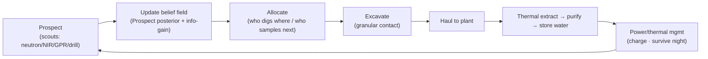
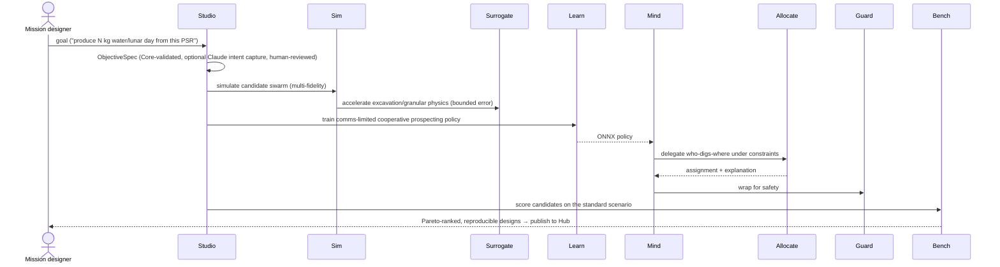
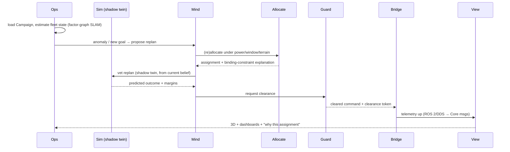

# Scenario 1 — Lunar Polar Water-Ice Prospecting & Extraction

> **Scenario id:** `lunar-polar-ice-prospecting` · **Anchor body:** the Moon, south-polar region
> (Shackleton–de Gerlache ridge) · **Regime:** `surface` (single-phase Mission) · **Roadmap:**
> Phase 0 anchor · **Status:** Draft.
>
> The platform's anchor scenario — the runnable MVP the whole Phase-0 stack is built to execute.
> Read with the [charter](../charter/Swarm_Exploration_ISRU_Orchestrator_OSS_Project.md),
> [system.md §10](../architecture/system.md), and the per-component
> [architecture](../architecture/README.md) docs. Cross-cutting standards:
> [conventions.md](../architecture/conventions.md). Scenario conventions and the shared template:
> [scenarios/README.md](README.md).

---

## 1. Summary

A heterogeneous swarm — scout rovers, excavators, haulers, at least one hopper, a central
thermal-extraction and water-purification/storage plant, surface power infrastructure, and a relay
orbiter — prospects the permanently shadowed regions (PSRs) of the lunar south pole for water ice,
then extracts, purifies, and stores it. The mission is a **single `surface`-phase Mission**: the
degenerate one-phase case of the [Mission/Phase/Regime model](../architecture/mission-model.md),
and exactly the swarm campaign the platform runs today. The baseline value chain **ends at stored
water** — characterizing the ice resource and producing usable water — which is the highest-value,
feature-complete objective achievable in Phase 0. Downstream conversion (electrolysis to LOX/LH₂
propellant) is a documented **future extension** (§15), not part of the baseline.

This scenario is the platform's proof that "thin core, thick swappable edges" produces a runnable,
reproducible benchmark a researcher can clone, run, and score in an afternoon (charter §11), while
stressing the hardest surface-autonomy problems: comms-denied PSR coordination, lunar-night
survival, granular excavation physics, and decision-making under deep resource-field uncertainty.

## 2. Strategic rationale

- **It is where the users already are.** Researchers in multi-agent autonomy, planetary robotics,
  terramechanics, and planetary science can use this scenario today; it needs no flight market to
  be valuable (charter §2, §9). This is the academic-flywheel ignition point.
- **It defines "done" for Phase 0.** The MVP loop — [Core](../architecture/core.md) +
  [Sim](../architecture/sim.md) + [Worlds](../architecture/worlds.md) +
  [Fleet](../architecture/fleet.md) + [Bench](../architecture/bench.md) on this scenario — is the
  concrete deliverable the roadmap is organized around (charter §9, §10; system.md §11).
- **It is rich in the hard problems.** Resource uncertainty, comms-denied PSRs, and energy survival
  are all present in one concrete, valued task (charter §11), so it is an honest benchmark, not a toy.
- **It is the one-phase case of the whole platform.** Because a single-`surface`-phase Mission is
  the degenerate case of the multi-regime model, everything proven here is directly reused by the
  full interplanetary [Scenario 2](2-asteroid-mining.md) — the two are points on one continuum.
- **It forces uncertainty-honest science.** Where the ice is, and how much, is genuinely unknown;
  the swarm must *plan to learn* (active perception), which is the platform's distinguishing
  commitment to first-class uncertainty (charter §8; conventions.md §1.6).

## 3. Mission objective & success criteria

**Objective (illustrative baseline — see [README honesty note](README.md#conventions)).**
*"Characterize the water-ice resource across a target PSR and produce and store a sustained supply
of purified water (order tonnes per lunar day), surviving the lunar night, under power and
comms-window constraints."*

| Success criterion | Baseline target (illustrative) | Maps to metric (§13) |
|---|---|---|
| Water produced & stored | sustained extraction toward an order-tonnes-per-lunar-day target | water mass produced |
| Resource characterized | ice-probability posterior uncertainty reduced ≥ X% over the target PSR | information gain |
| Energy survival | swarm survives ≥ N lunar nights without loss of critical assets | nights survived |
| Coordination robustness | mission goals met despite comms-denied PSR intervals (relay-window-gated) | comms robustness |
| Efficiency | energy per kg water within budget | energy/kg |
| Reproducibility | a researcher reproduces the Bench baseline byte-for-byte | reproducibility gate |

**Phase-0 runnable slice:** *prospecting + characterization only* (no extraction) — the smallest
end-to-end loop that a researcher can clone, run, and score, used to bootstrap the benchmark before
the extraction assets are modeled. **Stretch / future extension** (documented, not baseline):
electrolysis to LOX/LH₂ propellant and a propellant-depot value chain (§15).

### 3.1 How these objectives are defined, tracked & optimized

- **Defined** as an **`ObjectiveSpec`** — a first-class **[Core](../architecture/core.md) schema**
  (the objective plus its **binding** to [Bench](../architecture/bench.md) metrics and the
  [Ledger](../architecture/ledger.md) value model) — authored in [Studio](../architecture/studio.md)
  (optionally via human-reviewed LLM intent capture) and consumed by Bench/Ledger/Ops/View. Each
  success criterion above is **bound to a quantitative [Bench](../architecture/bench.md) metric**
  (§13) with an explicit target and tolerance — objectives are measurable, not aspirational, and
  carry uncertainty (conventions.md §1.6). A scalar economic valuation of produced water MAY use the
  [Ledger](../architecture/ledger.md) framework, but the baseline objective is the metric set itself.
- **Tracked & optimized** as described in §8.3: the same metric definitions are scored in
  simulation ([Bench](../architecture/bench.md)) and tracked live in operations
  ([Ops](../architecture/ops.md)/[View](../architecture/view.md)), and maximized by
  [Studio](../architecture/studio.md)'s trade-study engine with Pareto support.

## 4. Mission / Phase / Regime breakdown

The mission is a [`MissionSpec`](../architecture/mission-model.md) with **one `surface` Phase**
whose `campaign` is the swarm prospecting-and-extraction loop. There are no inter-phase Legs, no
trajectory artifacts, and no mission-architecture layer — this is the one-phase case that makes the
multi-regime generalization additive (mission-model.md §5).

| Phase | Regime | Environment | Entry → Exit | Duration (illustrative) | Key activities |
|---|---|---|---|---|---|
| Surface campaign | `surface` | [Worlds](../architecture/worlds.md) (Moon, south pole) | deployment complete → mission goal / end-of-campaign | weeks–months (multiple lunar day/night cycles) | prospect → allocate → excavate → haul → extract → purify → store; survive night |

Within the single phase, the swarm runs a continuous campaign loop:

The phase-sequencing schema is owned by [Core](../architecture/core.md); the campaign loop is the
*mechanism* in the [Sim](../architecture/sim.md)/[Ops](../architecture/ops.md) runtime, and the
*policy* (what to prospect, when to dig, how to survive night) lives in
[Studio](../architecture/studio.md)/[Ops](../architecture/ops.md).

## 5. Environment & world

| Aspect | Modeled by | Baseline (illustrative) |
|---|---|---|
| Site | [Worlds](../architecture/worlds.md) | **Shackleton–de Gerlache ridge**, lunar south pole (LOLA DEM → COG/Zarr) |
| Illumination & PSRs | Worlds | SPICE-driven illumination + **PSR detection** via horizon maps; near-eternal-light peaks adjacent to deep PSRs |
| Thermal | Worlds | 1-D thermophysical model; ~14-Earth-day night drives survival constraints; PSR floor ~tens of K |
| Resource field | [Prospect](../architecture/prospect.md) | water-ice probability as a **GP posterior** (mean ± variance) seeded from public priors (LOLA/Diviner/LEND/M³); sealed ground truth vs. agent belief |
| Regolith | Worlds | gravity-dominated terramechanics (bulk density, cohesion, friction, bearing) feeding Sim contact + excavation |
| Terrain | Worlds | slope/aspect/roughness → traversability masks for [Allocate](../architecture/allocate.md); keep-out for [Guard](../architecture/guard.md) |
| Comms geometry | [Link](../architecture/link.md) | LOS to relay orbiter + rim towers; **comms-denied inside PSRs**; one-way Earth light-time ~1.3 s; sparse relay/Earth windows |

The defining environmental difficulty is the **PSR**: high ice probability but no direct sunlight
(power) and no direct Earth line-of-sight (comms) — the opposite constraint geometry from the
sunlit, light-time-dominated [asteroid scenario](2-asteroid-mining.md).

## 6. Fleet & assets

All assets are [SADF](../architecture/fleet.md) documents with declared power/thermal/sensor/comms
and capability tags consumed by autonomy negotiation. Scale: **~12–25 heterogeneous agents**
(documented scale-up to 50+), covering the charter's full surface taxonomy.

| Asset | Count (illustrative) | Role | Key declared SADF capabilities |
|---|---|---|---|
| Scout / prospector rover | 3–5 | active-perception prospecting | neutron spectrometer, NIR, GPR, drill; `mobility.wheeled` |
| Excavator rover | 2–3 | granular excavation | `excavation.bucket`/auger; power/thermal budget |
| Hauler rover | 1–2 | move regolith/ore to the plant | capacity, traction, `mobility.wheeled` |
| Hopper | ≥1 | reach steep/rough PSR interiors | `mobility.hop`; sensor payload |
| Central extraction plant | 1 | thermal extraction → purification → storage | thermal-input power, throughput (kg/hr), storage capacity |
| Power infrastructure | — | generate/store/distribute energy | solar arrays, battery, RTG/RHU, radiators |
| Relay orbiter | 1 | comms relay + Earth-link gateway | `comms.relay`; `mobility.orbiter`; station-keeping Δv |

Each asset declares **multi-fidelity tiers** (mass / kinematic / articulated) under one stable
identity so Sim's scheduler can dial fidelity without re-instantiation (fleet.md). The baseline has
**no electrolysis or cryo-propellant assets** — the value chain ends at stored water (§15 for the
extension).

## 7. Concept of operations (ConOps)

1. **Deploy & establish.** Assets are placed on the Shackleton–de Gerlache ridge; the relay orbiter
   and rim relay towers establish the comms backbone; power infrastructure (peak-of-light solar +
   storage) comes online.
2. **Prospect.** Scout rovers (and the hopper for hard-to-reach interiors) traverse from lit staging
   areas into PSRs, taking neutron/NIR/GPR/drill measurements — each measurement updates
   [Prospect](../architecture/prospect.md)'s belief posterior and shrinks its uncertainty.
3. **Decide where to learn / dig.** [Allocate](../architecture/allocate.md) trades active-perception
   value (information gain) against extraction ROI under power, comms-window, and terrain
   constraints — choosing both *where to sample next* and *where/how deep to dig*.
4. **Excavate & haul.** Excavators dig the highest-confidence, highest-grade patches (granular
   contact physics); haulers move regolith to the central plant — every actuation cleared by
   [Guard](../architecture/guard.md) against collision, slope, power-floor, and keep-out limits.
5. **Extract, purify, store.** The central plant thermally extracts water from regolith, purifies,
   and stores it; production accrues toward the objective.
6. **Manage energy & survive night.** Assets charge in lit periods; as the ~14-day night
   approaches, the swarm ratchets into survival mode (shelter, RTG/RHU heating, minimal duty) and
   resumes at dawn.
7. **Coordinate through comms gaps.** Inside PSRs and between relay windows, agents act on cached
   intent with delay-tolerant fallbacks, reconciling when the relay window reopens.
8. **Close the loop.** Telemetry refines Prospect's belief field and feeds new
   [Bench](../architecture/bench.md) scenarios; the commons compounds.

## 8. Design & operation workflows

### 8.1 Design-mode workflow (Studio)

A mission designer states a goal in [Studio](../architecture/studio.md); the design loop turns it
into a scored, reproducible campaign (charter §3; system.md §6.1).

**Step-by-step (artifact at each step):** goal → Core-validated `ObjectiveSpec` → candidate
`DesignCandidate`s (Fleet compositions + policies) → Sim rollouts (Surrogate-accelerated for
excavation) → trained ONNX policy (Learn) → composed plan (Mind) + assignment (Allocate) +
assurance (Guard) → Bench score → `Campaign` published to [Hub](../architecture/hub.md). Trade
studies fan out on [Cloud](../architecture/cloud.md).

### 8.2 Operate-mode workflow (Ops)

[Ops](../architecture/ops.md) takes the validated `Campaign`, maintains fleet-wide state
(collaborative factor-graph SLAM in a GNSS-denied, feature-poor environment), and runs a
[Sim](../architecture/sim.md) **shadow twin** that vets every replan before commit;
[Guard](../architecture/guard.md) clears each command; [Bridge](../architecture/bridge.md) drives
the simulator today (real rovers later) over ROS 2 with the *same plan bytes*. The operator
supervises through [View](../architecture/view.md) via **intent-envelope approval** under ~1.3 s
latency (delay-tolerant adjustable autonomy), with pre-approved contingency branches for
comms-denied PSR intervals.

### 8.3 Objective tracking & multi-objective optimization

**Where maximization lives.** Optimizing the mission to maximize the §3 objectives is
[Studio](../architecture/studio.md)'s **trade-study engine** (design mode). Because the campaign is
inherently multi-objective (water produced vs. energy/kg vs. night-survival robustness vs. comms
robustness), it returns a **Pareto front** of non-dominated designs rather than a single "best."
Backends (studio.md §11): **Bayesian multi-objective optimization** (Ax/BoTorch — sample-efficient,
recommended for expensive [Sim](../architecture/sim.md) evaluations) and **evolutionary** (pymoo
NSGA-II/III); **scalarization** (weighted/utility functions) is available where a single ranking is
wanted. Sub-objectives are optimized by the components that own them —
[Allocate](../architecture/allocate.md) maximizes water-under-constraints (anytime, with optimality
bounds) and [Learn](../architecture/learn.md) optimizes policy reward — against objectives derived
from the ObjectiveSpec/metrics.

**Tracking in both modes — one definition, two evaluations.** The *same* metric definitions are
evaluated in design and operations: [Bench](../architecture/bench.md) scores them over
[Sim](../architecture/sim.md) rollouts (deterministic, reproducible) during design, and
[Ops](../architecture/ops.md) tracks live progress against the same targets during operations —
produced-water burn-down, energy/kg, projected attainment, and margins — surfaced through
[View](../architecture/view.md). Defining a metric once and evaluating it in both loops is the reuse
property (system.md §6) that makes a design-time score and an operational reading directly
comparable.

## 9. Hard problems exercised

| Problem (charter §7 research / §8 engineering) | How this scenario stresses it |
|---|---|
| Cooperative MARL under partial observability & intermittent comms (§7) | PSR comms-denied coordination; relay-window-gated cooperation |
| Decision-making under deep resource-field uncertainty (§7) | plan-to-learn: active perception vs. production trade-off over an uncertain ice field |
| Energy/thermal ultra-long-horizon planning (§7) | surviving the ~14-day lunar night reframes planning around survival |
| Swarm SLAM in feature-poor, GNSS-denied terrain (§7) | collaborative localization with scarce landmarks |
| Granular/excavation physics at interactive speed (§8) | bounded-error [Surrogate](../architecture/surrogate.md) for excavation contact |
| Fidelity–speed frontier (§8) | validation-grade vs. training-fast at swarm scale via the multi-fidelity scheduler |
| Verifiable safety of learned policies (§8) | [Guard](../architecture/guard.md) shields on every path to actuation |
| Delay-tolerant supervisory autonomy (§7) | one operator supervising many robots under latency + comms gaps |

## 10. Constraints & assumptions

- **Power.** Solar only on lit peaks; PSR work runs on stored/teleported energy and RTG/RHU; the
  battery floor is a hard [Guard](../architecture/guard.md) constraint.
- **Lunar night.** ~14 Earth-days of darkness/cold per cycle; survival (not productivity) governs
  planning across the night boundary.
- **Comms.** PSR interiors lose direct Earth LOS; coordination is relay-window-gated with
  store-and-forward; light-time is short (~1.3 s) but windows are sparse and occlusion is severe.
- **Terrain.** Steep PSR walls and rough floors constrain rover traversal (hopper for the hardest
  interiors); slope limits are Guard keep-outs.
- **Resource uncertainty.** Ice location/grade/depth are uncertain priors; the swarm must reduce
  uncertainty as it produces (active perception).
- **Determinism & provenance.** Seeded runs; content-addressed worlds/assets/policies/scenarios so a
  [Bench](../architecture/bench.md) result reproduces exactly (conventions.md §5, §11).
- **Assumption:** ground-truth ice is a sealed realization from a public-data-seeded prior; agents
  see only the belief field (sealed-truth/belief isolation is safety-critical — prospect.md).

### Genuine design forks (options → recommendation)

**Fork A — Anchor site.**
- *Shackleton–de Gerlache ridge.* Pro: near-eternal-light peaks for power directly beside
  high-ice-probability PSRs; strong LOLA DEM; Artemis relevance → credibility. Con: steep,
  challenging terrain.
- *Cabeus.* Pro: LCROSS-confirmed volatiles. Con: poorly lit (power-starved), less Artemis-relevant.
- *Haworth / Faustini / Nobile.* Pro: large PSRs, Nobile is an Artemis candidate. Con: power
  geometry less favorable than Shackleton's ridge.
- **Recommendation: Shackleton–de Gerlache ridge.** Best power-beside-resource geometry, real DEM,
  and mission relevance. *(Others documented as alternative Bench worlds.)*

**Fork B — Extraction method.**
- *Excavate-and-haul to a central plant.* Pro: concentrated processing, simpler thermal management;
  exercises excavation + hauling coordination. Con: hauling energy/logistics overhead.
- *In-situ thermal mining (heat/sublimate in place, capture vapor).* Pro: avoids hauling; rich
  thermal physics. Con: lower throughput per site; harder vapor capture.
- *Hybrid (mobile excavators feed a central plant; in-situ thermal probes in the richest PSR
  pockets).* Pro: exercises **both** granular excavation and thermal extraction — richest for
  benchmarking and most feature-complete. Con: most assets/complexity.
- **Recommendation: hybrid.** Highest value and the most complete physics coverage for a flagship.
  *(Excavate-and-haul documented as the simpler MVP variant.)*

**Fork C — Power & lunar-night survival.**
- *Peak-of-light vertical solar arrays + energy storage; RTG/RHU for PSR night survival.* Pro:
  leverages the site's near-eternal light; proven survival approach. Con: storage mass; PSR power
  delivery is hard.
- *Surface fission (Kilopower/FSP-class).* Pro: continuous power independent of sun/night — enables
  sustained PSR ops. Con: mass, cost, complexity, handling.
- *Beamed power (solar tower → PSR receivers via laser/microwave).* Pro: power into PSRs without
  hauling fuel. Con: pointing/efficiency, immature.
- **Recommendation: peak-of-light solar + storage, RTG/RHU for survival**, with **surface fission
  documented as the continuous-PSR-ops stretch**. Night survival is a flagship hard problem
  (charter §6), so the baseline must face it head-on rather than assume continuous power.

**Fork D — Comms (lighter fork).** Relay orbiter + rim relay towers (recommended — LOS into PSRs;
comms-denied coordination is the core challenge) vs. direct-to-Earth only (simpler, but
geometry-limited at the pole and unable to reach PSR interiors).

*Settled / platform-mandated (stated, not "optioned"):* autonomy is the **hybrid** plan→TAMP→control
+ learned-policy stack ([Mind](../architecture/mind.md)); allocation is **CP-SAT + learned
warm-starts** ([Allocate](../architecture/allocate.md)); resource fields and surrogate outputs are
**uncertainty-first** (conventions.md §1.6); every action crosses [Guard](../architecture/guard.md);
ground-truth/belief isolation is enforced; reproducibility is content-addressed.

## 11. Components exercised

The mission-architecture layer ([Trajectory](../architecture/trajectory.md)/[Sizing](../architecture/sizing.md)/[Ledger](../architecture/ledger.md))
and [Transit](../architecture/transit.md) are **not exercised** by this single-`surface`-phase
baseline (no inter-body legs); [Ledger](../architecture/ledger.md)'s framework MAY still value
produced water. Everything else is in play.

| Component | What this scenario demands of it |
|---|---|
| [Core](../architecture/core.md) | SADF for the heterogeneous fleet; Environment API with comms/observation masks; Policy API; capability negotiation |
| [Worlds](../architecture/worlds.md) | Shackleton DEM (COG/Zarr); SPICE illumination + **PSR detection**; thermal & regolith fields; traversability |
| [Prospect](../architecture/prospect.md) | water-ice GP posterior; sealed-truth/belief isolation; **information-gain maps** for active perception |
| [Link](../architecture/link.md) | relay + rim-tower LOS; PSR comms-denial; contact windows as hard constraints; observation masks |
| [Fleet](../architecture/fleet.md) | scout/excavator/hauler/hopper/plant/power/orbiter SADF; excavation & relay capability tags; fidelity tiers |
| [Sim](../architecture/sim.md) | multi-physics (mobility, **granular excavation**, power/thermal, sensors); multi-fidelity scheduler; shadow twin; determinism |
| [Surrogate](../architecture/surrogate.md) | bounded-error excavation/granular surrogate (GNN) with `ErrorReport`; gates fidelity substitution |
| [Mind](../architecture/mind.md) | hierarchical plan→TAMP→control; delay-tolerant fallbacks for comms-denied PSRs; Guard-wrapped output |
| [Learn](../architecture/learn.md) | MARL cooperative prospecting under comms dropout (CommsModel); active perception; ONNX export |
| [Allocate](../architecture/allocate.md) | CP-SAT (+ learned warm-starts) over power/comms-window/terrain; info-gain vs. ROI; explanations |
| [Guard](../architecture/guard.md) | collision/slope/keep-out shields; **power-floor & thermal** monitors; night-survival safe behaviors |
| [Studio](../architecture/studio.md) | goal-in/design-out; trade studies; campaign authoring; optional Claude intent capture |
| [Ops](../architecture/ops.md) | collaborative factor-graph SLAM; shadow-twin vetting; delay-tolerant intent-envelope supervision |
| [Bridge](../architecture/bridge.md) | ROS 2/DDS to sim today / rovers later; identical-plan invariant; fail-safe translation |
| [View](../architecture/view.md) | 3D terrain + PSR/illumination overlay; resource-field uncertainty heatmap; plan explanation |
| [Bench](../architecture/bench.md) | the **anchor** reference scenario; metrics; reproducibility harness; leaderboard |
| [Hub](../architecture/hub.md) | worlds/assets/policies/surrogates artifact types; capability-negotiated discovery |
| [Cloud](../architecture/cloud.md) | Sim sweeps, Learn training, Allocate solves, Bench eval (CPU-bound, local tier must also work) |

## 12. Derived requirements

Authoritative, traceable requirements. IDs are stable and append-only:
`LUNAR-<CAT>-NNN` where `<CAT>` ∈ `FR/TR/UX/DR/SR`.

### 12.1 Functional & technical requirements
- **LUNAR-FR-001** — [Worlds](../architecture/worlds.md) MUST ingest a real polar DEM and produce
  SPICE-driven illumination with **PSR detection** over a defined epoch window.
- **LUNAR-FR-002** — [Prospect](../architecture/prospect.md) MUST represent the ice field as a
  posterior with explicit uncertainty, expose **information-gain maps**, and keep sealed ground
  truth isolated from agent-facing belief.
- **LUNAR-FR-003** — [Sim](../architecture/sim.md) MUST simulate mobility, granular excavation,
  power/thermal evolution, and sensors at swarm scale, with a multi-fidelity scheduler.
- **LUNAR-FR-004** — [Allocate](../architecture/allocate.md) MUST solve task allocation under
  coupled power, comms-window, and terrain constraints, trading information gain against extraction.
- **LUNAR-FR-005** — [Mind](../architecture/mind.md) MUST compose plan→TAMP→control and degrade
  gracefully (not collapse) under comms-denied PSR intervals.
- **LUNAR-FR-006** — [Guard](../architecture/guard.md) MUST enforce hard constraints (collision,
  slope, **power floor**, thermal ceiling, keep-out) independently of learned components, on every
  path to actuation.
- **LUNAR-FR-007** — [Bench](../architecture/bench.md) MUST define the anchor scenario with pinned
  content and seeds so a baseline is reproducible.
- **LUNAR-TR-001** — All spatial data MUST carry an explicit lunar body-fixed CRS resolved via
  SPICE/PROJ; SI units; no implicit Earth/WGS84 (conventions.md §5).
- **LUNAR-TR-002** — The excavation [Surrogate](../architecture/surrogate.md) MUST ship a bounded
  `ErrorReport`; Sim MUST refuse substitution beyond task tolerance (conventions.md §8).
- **LUNAR-TR-003** — Comms availability MUST be modeled (LOS, relay windows, PSR denial) and applied
  as observation masks through the Core Environment API.
- **LUNAR-TR-004** — The full MVP loop MUST run on a single workstation, offline, with no cloud or
  account (conventions.md §7 tier 1) — "clone, run, score in an afternoon."
- **LUNAR-TR-005** — Granular physics MUST validate against analytic/lab terramechanics references
  with explicit error budgets (conventions.md §11).
- **LUNAR-FR-008** — [Core](../architecture/core.md) MUST define the **`ObjectiveSpec`** schema and
  the **objective→metric binding** as a narrow-waist contract; [Studio](../architecture/studio.md)
  authors instances with explicit quantitative targets and tolerances, each success criterion
  **bound to a [Bench](../architecture/bench.md) metric** (§13), consumed by Bench/Ledger/Ops/View.
- **LUNAR-FR-009** — The platform MUST quantitatively track progress toward each objective in
  **both simulation** ([Bench](../architecture/bench.md) over [Sim](../architecture/sim.md)) **and
  operations** ([Ops](../architecture/ops.md), surfaced via [View](../architecture/view.md)), using
  the **same metric definitions** so the two are comparable.
- **LUNAR-FR-010** — The platform MUST support **multi-objective optimization** over the objectives,
  producing a **Pareto front** in [Studio](../architecture/studio.md)'s trade-study engine, with
  scalarization as an option; sub-objectives are optimized by [Allocate](../architecture/allocate.md)
  and [Learn](../architecture/learn.md).
- **LUNAR-TR-006** — Objective metrics MUST be deterministic and content-addressed
  (conventions.md §5, §11) so a design-time score and an operational reading of the same objective
  reproduce and are comparable.

### 12.2 User-experience / high-level workflows
- **LUNAR-UX-001** — A designer MUST be able to go goal-in → scored-design-out via
  [Studio](../architecture/studio.md), with optional (human-reviewed) LLM intent capture.
- **LUNAR-UX-002** — [View](../architecture/view.md) MUST render 3D terrain with illumination/PSR
  overlays and the resource-field posterior **with uncertainty** (no false-precision heatmaps).
- **LUNAR-UX-003** — Operators MUST supervise via **intent-envelope approval** under latency, with
  plan-explanation ("why this assignment / why dig here") from Mind/Allocate/Guard traces.
- **LUNAR-UX-004** — Allocate decisions surfaced to the operator MUST carry binding-constraint
  explanations (which power floor / comms window / slope limit bound the result).
- **LUNAR-UX-005** — A researcher MUST be able to submit a policy/planner from
  [Hub](../architecture/hub.md) to the Bench leaderboard and get a reproducible score.
- **LUNAR-UX-006** — Designers/operators MUST see **quantitative objective progress** (per-metric
  attainment, burn-down, margins, projected completion) and the **multi-objective trade-offs**
  (Pareto front) in [Studio](../architecture/studio.md)/[View](../architecture/view.md).

### 12.3 Data requirements
- **LUNAR-DR-001** — Inputs: LOLA DEM, SPICE kernels, public water-ice/hydrogen priors
  (Diviner/LEND/M³), relay-orbit ephemeris.
- **LUNAR-DR-002** — Generated artifacts: illumination/PSR/thermal precomputes, belief-field
  posteriors, ContactPlans, excavation surrogates, simulation traces (MCAP), Bench results.
- **LUNAR-DR-003** — Formats per conventions.md §5: COG (DEM), Zarr (fields), Parquet/Arrow
  (windows/results), MCAP (traces), ONNX (policies/surrogates), SADF (YAML/JSON + proto).
- **LUNAR-DR-004** — Every artifact MUST record provenance (input hashes, code version, lockfile,
  seed); Bench results MUST reproduce byte-for-byte (content-addressing).
- **LUNAR-DR-005** — Prospect ground truth MUST be access-gated and never leaked to policies; belief
  fields carry full uncertainty (calibration checked in CI).

### 12.4 Security requirements
- **LUNAR-SR-001** — AuthN (OIDC) + AuthZ (OPA) MUST gate sensitive actions; capability tags gate
  capability-tagged artifacts/adapters (conventions.md §9, §12).
- **LUNAR-SR-002** — Shared artifacts MUST be signed (Sigstore/cosign) with SLSA provenance + SBOM,
  re-verified at pull by [Hub](../architecture/hub.md); plugins load only after manifest signature +
  Core-version checks.
- **LUNAR-SR-003** — Untrusted/non-Python plugins MUST run sandboxed (containers/gVisor; WASM later).
- **LUNAR-SR-004** — [Guard](../architecture/guard.md)'s safety core MUST be a minimal, independent
  trusted computing base that fails safe (never fails open) under stale state or missed deadlines.
- **LUNAR-SR-005** — The sealed ground-truth resource field MUST be access-controlled; leakage to
  agent-facing belief is a security-class defect, enforced by contract tests.

## 13. Evaluation & metrics

This is the **anchor [Bench](../architecture/bench.md) scenario** ("Lunar Polar Water-Ice
Prospecting v1"), content-pinned (Core versions; Worlds/Fleet/Prospect/Link hashes; seed sets;
episode length spanning lunar day/night) for byte-for-byte reproducibility, with public dev seeds +
held-out seeds (anti-gaming) and submit-policy-we-run execution.

| Metric | Definition |
|---|---|
| Water mass produced | kg of purified water stored over the campaign |
| Energy per kg | energy expended per kg water (efficiency) |
| Information gain | reduction in Prospect ice-field posterior uncertainty over the target PSR |
| PSR area characterized | area surveyed to a target confidence |
| Nights survived | lunar nights survived without loss of critical assets |
| Comms robustness | goal attainment under modeled relay-window/PSR-denial dropout |
| Discovery latency | time (sols) to first confirmed water finding |

Scoring is deterministic and (for a multi-objective campaign) Pareto-ranked; a leaderboard number is
meaningless if it cannot be reproduced (conventions.md §5, §11; bench.md).

## 14. Dual-use & export-control considerations

This scenario sits squarely in the **open commons**: science, simulation, and coordination
(conventions.md §12). It does not involve trajectory/maneuver design, so the
`operational_targeting` dual-use gate that dominates the [asteroid scenario](2-asteroid-mining.md)
is **not** exercised here. Still:

- **Bridge partitioning applies.** [Bridge](../architecture/bridge.md) flight-hardware adapters live
  in access-controlled repos behind capability gates; the open repo ships sim + generic ROS 2
  adapters only (conventions.md §12).
- **Commons/commercial split.** Any economic valuation of produced water via
  [Ledger](../architecture/ledger.md) uses the open framework; proprietary cost/pricing data stay
  commercial plugins (charter §3).
- **Capability gating is first-class**, not a bolt-on — the same mechanism serves autonomy
  negotiation and any future export-control needs (system.md §12).

## 15. Roadmap alignment

- **Phase 0 (this scenario):** stand up [Core](../architecture/core.md) v0.1 +
  [Sim](../architecture/sim.md) + [Worlds](../architecture/worlds.md) +
  [Fleet](../architecture/fleet.md) + [Bench](../architecture/bench.md) (+
  [Prospect](../architecture/prospect.md), local [Cloud](../architecture/cloud.md)) — a runnable,
  reproducible benchmark on this anchor scenario (charter §9; system.md §11). The
  *prospecting-only* slice (§3) is the first runnable milestone; *water extraction* is the
  feature-complete Phase-0 baseline.
- **Phase 1:** [Mind](../architecture/mind.md), [Learn](../architecture/learn.md),
  [Allocate](../architecture/allocate.md), [Guard](../architecture/guard.md),
  [Studio](../architecture/studio.md), [Hub](../architecture/hub.md),
  [Surrogate](../architecture/surrogate.md), full [Link](../architecture/link.md) — the MARL +
  planning commons with public leaderboards; also reserve the additive Mission/Phase/Regime Core
  hooks for [Scenario 2](2-asteroid-mining.md).
- **Phase 2:** [Ops](../architecture/ops.md), [Bridge](../architecture/bridge.md),
  [View](../architecture/view.md); digital-twin shadow mode validated against terrestrial analog
  rover-swarm field tests.
- **Future extension (beyond baseline):** electrolysis to LOX/LH₂ and a propellant-depot value
  chain — added as new SADF assets + processes without a Core change.

## 16. Open questions

- **PSR-mask epoch semantics** — over which epoch range is "permanent" shadow defined (diurnal /
  seasonal / mission)? [Bench](../architecture/bench.md) must formalize this (worlds.md §11).
- **Active-perception objective** — BALD/mutual-information vs. expected-value-of-information on ISRU
  yield (Prospect ↔ Allocate co-design).
- **Stochastic vs. deterministic re-solve** under resource uncertainty — how much planning-to-learn
  beats deterministic re-solve (charter §7; allocate.md).
- **Surrogate error bounds for autoregressive excavation rollouts** — calibrated long-horizon
  coverage is an open research problem (charter §8; surrogate.md).
- **Night-survival modeling depth** — how faithfully to simulate the full thermal night vs. a gated
  survival check, and how it scores in Bench.
- **Sim-to-real terramechanics** — honestly bounding low-gravity granular uncertainty without
  on-world data (charter §8).
- **Objective contract** *(resolved — Phase-0 direct decision, no RFC)* — the `ObjectiveSpec` and
  the objective→metric **binding** are a **first-class additive [Core](../architecture/core.md)
  schema**; [Studio](../architecture/studio.md) authors instances, and
  [Bench](../architecture/bench.md)/[Ledger](../architecture/ledger.md)/[Ops](../architecture/ops.md)/[View](../architecture/view.md)
  consume them (see [core.md](../architecture/core.md)).

## 17. References

- [Project charter](../charter/Swarm_Exploration_ISRU_Orchestrator_OSS_Project.md) — §2, §7, §8, §9, §10, §12.
- [system.md §10](../architecture/system.md) — anchor-scenario integration walkthrough;
  [conventions.md](../architecture/conventions.md) — cross-cutting standards.
- Component docs: [Worlds](../architecture/worlds.md), [Prospect](../architecture/prospect.md),
  [Link](../architecture/link.md), [Fleet](../architecture/fleet.md), [Sim](../architecture/sim.md),
  [Surrogate](../architecture/surrogate.md), [Mind](../architecture/mind.md),
  [Learn](../architecture/learn.md), [Allocate](../architecture/allocate.md),
  [Guard](../architecture/guard.md), [Studio](../architecture/studio.md),
  [Ops](../architecture/ops.md), [Bridge](../architecture/bridge.md),
  [View](../architecture/view.md), [Bench](../architecture/bench.md),
  [Hub](../architecture/hub.md), [Cloud](../architecture/cloud.md).
- External: SPICE/NAIF; LOLA DEM; Diviner/LEND/M³ volatile priors; USGS Astrogeology / PDS;
  PettingZoo/Gymnasium, Ray RLlib, OR-Tools/CP-SAT.
- Multi-regime continuity: [RFC-0001](../rfc/0001-multi-regime-missions.md),
  [mission-model.md](../architecture/mission-model.md) — this scenario is the one-phase case.
