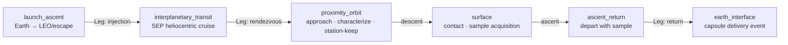
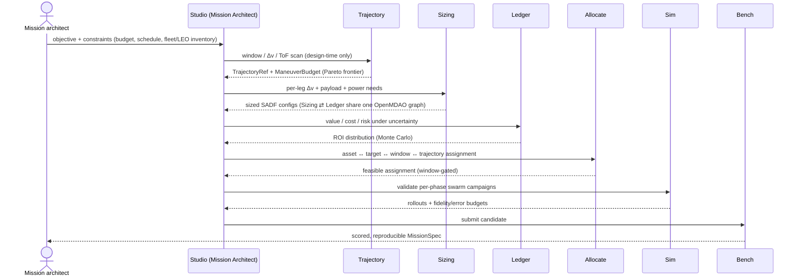
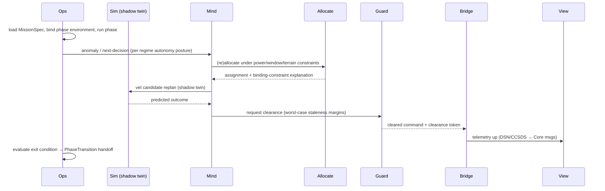

# Scenario 2 — Asteroid Mining (launch & return)

> **Scenario id:** `asteroid-mining` · **Anchor body:** C-type near-Earth object (NEO),
> Bennu/Ryugu-class rubble pile · **Regimes:** all six (`launch_ascent · interplanetary_transit ·
> proximity_orbit · surface · ascent_return · earth_interface`) · **Roadmap:** Phase 3 capstone
> (baseline = NEO rendezvous + sample-return, the [RFC-0001](../rfc/0001-multi-regime-missions.md)
> R5 stepping-stone) · **Status:** Draft.
>
> The full multi-regime flagship. Read with the [charter](../charter/Swarm_Exploration_ISRU_Orchestrator_OSS_Project.md),
> [RFC-0001](../rfc/0001-multi-regime-missions.md), the [Mission/Phase/Regime model](../architecture/mission-model.md),
> and [system.md §13](../architecture/system.md). Cross-cutting standards:
> [conventions.md](../architecture/conventions.md). Scenario conventions and the shared template:
> [scenarios/README.md](README.md).

---

## 1. Summary

A fleet launches from Earth (reusing assets already in LEO where possible), cruises to a
volatile-rich near-Earth asteroid under solar-electric propulsion, characterizes the body's
shape, gravity, and resource field on arrival, descends to the surface to acquire a bulk
regolith sample, and returns that sample to Earth — an end-to-end **Mission** spanning all six
regimes of the [Mission/Phase/Regime model](../architecture/mission-model.md). The baseline is
deliberately a **NEO rendezvous + sample-return** mission: the concrete, achievable first rung
of the asteroid-mining vision that exercises the entire launch-to-return lifecycle. Sustained
production — anchored excavation, in-situ volatile extraction, tonne-scale or in-situ-propellant
return — is the documented **capstone** the baseline is architected to grow into (§15), not the
first deliverable.

This is the platform's hardest, most complete demonstration: it puts the
[mission-architecture layer](../architecture/README.md) (Trajectory · Sizing · Ledger), the
deep-space environment ([Transit](../architecture/transit.md)), microgravity contact physics,
deep-space-latency autonomy, and the dual-use boundary all in one campaign — while a single-body
surface campaign ([Scenario 1](1-lunar-polar-ice-prospecting.md)) remains the degenerate
one-phase case of the same model.

## 2. Strategic rationale

- **Proves the whole platform thesis at once.** A mission that survives launch, months of cruise,
  proximity operations around an uncharacterized irregular body, surface contact in microgravity,
  ascent, and Earth return is the strongest possible evidence that "thin core, thick swappable
  edges" scales from one world to a full interplanetary campaign (charter §3, §10).
- **Activates a new audience without disrupting the old.** Mission & systems engineers,
  astrodynamicists, and resource economists join the robotics/RL/planetary-science base via the
  [Mission Architect](../architecture/studio.md) surface (charter §2; RFC-0001 motivation), while
  every existing single-body scenario runs unchanged.
- **Forces the dual-use line to be real, not rhetorical.** Trajectory work is the most
  export-sensitive capability the platform will ever host; making it a *flagship* is what compels
  the design-time-only boundary to be drawn in the schema and enforced at the
  [Bridge](../architecture/bridge.md)/registry (§14; RFC-0001 §6).
- **Sample-return is the credible stepping stone.** It is concrete, valued, and achievable, and
  it validates the prospect → approach → contact → return loop end-to-end before any commitment to
  sustained production — exactly the sequencing RFC-0001 R5 prescribes (NEO sample-return →
  asteroid-mining capstone).
- **High novelty, hard science.** Microgravity contact/anchoring, relative navigation around an
  uncharacterized body, window-gated no-recovery decisions under light-time, and
  trajectory⇄fleet⇄swarm⇄economics co-optimization are open research problems (charter §7),
  framed here as a single benchmark.

## 3. Mission objective & success criteria

**Objective (illustrative baseline — see [README honesty note](README.md#conventions)).**
*"Rendezvous with a volatile-rich C-type NEO, characterize its resource field, acquire and return
a bulk regolith sample of tens of kilograms to Earth, within a fixed cost and schedule envelope —
demonstrating the complete launch-to-return mining precursor loop."*

| Success criterion | Baseline target (illustrative) | Maps to metric (§13) |
|---|---|---|
| Sample returned to Earth | ≥ 1 capsule, **10–50 kg** bulk regolith delivered | delivered sample mass |
| Resource characterization | Volatile-content posterior uncertainty reduced ≥ X% over the sampled region | information gain |
| Mission completes all six phases | All `PhaseTransition` handoffs succeed; no phase-fatal anomaly | phase completion |
| Within envelope | Total cost ≤ budget; schedule ≤ N years (window-feasible) | ROI-under-uncertainty, schedule |
| Autonomy under latency | No loss-of-mission attributable to a missed/incorrect deep-space decision | autonomy-under-light-time |
| Contact success | Anchored sampling completes within reaction-force/anchoring limits | anchoring/contact success |

**Stretch / capstone goals** (documented, not baseline): in-situ volatile *extraction* assay
(measure water yield from a few kg), sustained excavation to tonne scale, and **in-situ-propellant
return** (using mined volatiles for return Δv) — see §15.

### 3.1 How these objectives are defined, tracked & optimized

- **Defined** as an **`ObjectiveSpec`** — a first-class **[Core](../architecture/core.md) schema**
  (the objective plus its **binding** to [Bench](../architecture/bench.md) metrics and the value
  model) — authored in [Studio](../architecture/studio.md)'s Mission Architect and rolled up into
  the Mission's **`objective` value/score model in [Ledger](../architecture/ledger.md)** (mission-model.md §1).
  Each success criterion above is **bound to a quantitative [Bench](../architecture/bench.md) metric**
  (§13) with explicit target and tolerance; cost/value/risk are distributions, not point estimates
  (conventions.md §1.6).
- **Tracked & optimized** as in §8.3: the same metrics are scored in simulation and tracked live in
  operations, and maximized by the Mission Architect's trajectory⇄fleet⇄swarm⇄economics
  co-optimization with Pareto support.

## 4. Mission / Phase / Regime breakdown

The mission is a [`MissionSpec`](../architecture/mission-model.md#2-core-schema-extensions-additive):
an objective (Ledger value model), a fleet (SADF assets incl. reusable LEO inventory), global
constraints, and an ordered list of phases, each in one **Regime**, connected by **Legs**
(design-time `TrajectoryRef`/`ManeuverBudget` artifacts).

| Phase | Regime | Environment | Entry → Exit | Duration (illustrative) | Key activities |
|---|---|---|---|---|---|
| Launch & ascent | `launch_ascent` | Worlds (Earth boundary) | liftoff → escape/LEO state | minutes–hours | powered ascent; LEO aggregation; reusable-tug mate |
| Cruise | `interplanetary_transit` | [Transit](../architecture/transit.md) | escape → NEO arrival state | ~1–2 yr | SEP low-thrust arc; radiation/thermal exposure; sparse DSN contacts |
| Proximity | `proximity_orbit` | [Worlds](../architecture/worlds.md) small-body + Transit | arrival → descent-ready | weeks–months | shape/gravity estimation; relay deploy; resource survey; site selection |
| Surface | `surface` | Worlds (small body) | touchdown → sample secured | hours–days per contact | anchored contact; bulk regolith acquisition; assay |
| Ascent & return | `ascent_return` | Worlds boundary → Transit | liftoff → return injection | months (incl. cruise) | ascent; rendezvous/stow; return SEP arc |
| Earth interface | `earth_interface` | boundary **event** | return approach → recovery | event | **ballistic capsule delivery + recovery** (mass/Δv accounting — *not* guided EDL, §14) |

The phase **schema** is owned by [Core](../architecture/core.md); the sequencing **mechanism** (run
a phase, evaluate entry/exit, perform the state handoff) is a thin sequencer in the
[Sim](../architecture/sim.md)/[Ops](../architecture/ops.md) runtime; the **policy** (ordering,
contingencies, window-miss responses) lives in [Studio](../architecture/studio.md)/Ops
(RFC-0001 R2; mission-model.md §3).

## 5. Environment & world

| Aspect | Modeled by | Baseline (illustrative) |
|---|---|---|
| Target body | [Worlds](../architecture/worlds.md) small-body pack | C-type rubble pile modeled on **101955 Bennu / 162173 Ryugu** (real OSIRIS-REx / Hayabusa2 shape & gravity → credibility); mission target a representative accessible low-Δv NEO |
| Shape | Worlds | 3-D **closed polyhedral** shape model (not a 2.5-D heightfield), per the small-body pack |
| Gravity | [Transit](../architecture/transit.md) + Worlds | polyhedral / mascon near-field + harmonic far-field; ~10⁻⁴–10⁻³ g surface |
| Regolith | Worlds (microgravity taxonomy) | **cohesion-dominated** (cohesion ~10–100 Pa dominates weight), distinct from gravity-dominated lunar terramechanics — a *new* contact regime, not a parameter tweak (worlds.md §11) |
| Thermal | Worlds | rapid-rotation diurnal cycle; rubble-pile heterogeneity; no eclipses from other bodies in proximity |
| Resource field | [Prospect](../architecture/prospect.md) | volatile/hydrate distribution as a GP posterior (mean ± variance) from carbonaceous-chondrite spectral priors; sealed ground truth vs. agent belief |
| Deep-space env | [Transit](../architecture/transit.md) | n-body heliocentric dynamics; solar-radiation pressure; GCR/SEP radiation; micrometeoroid (Grün) flux — all uncertainty-tracked |
| Comms geometry | [Link](../architecture/link.md) | sparse DSN passes, **8–20 min one-way light-time**; relay orbiter for surface↔orbiter LOS; store-and-forward |

There are **no PSRs** here (rapid rotation, sunlit surface) — the opposite of
[Scenario 1](1-lunar-polar-ice-prospecting.md); the hard comms constraint is light-time and DSN
scarcity, not permanent shadow.

## 6. Fleet & assets

All assets are [SADF](../architecture/fleet.md) documents; `launch_vehicle`/`return_vehicle` are
**asset kinds in Fleet**, not new Core types (mission-model.md §2.1). [Sizing](../architecture/sizing.md)
resolves parametric families to concrete sized configs.

| Asset | Role | Key declared SADF capabilities | Active in regimes |
|---|---|---|---|
| Launch vehicle | Earth → LEO/escape | `mobility.rocket`, staging, cryo propulsion, Δv budget | launch_ascent |
| Reusable LEO tug | LEO aggregation & transfer (reused across launches) | `propulsion.*`, reusable, in-orbit initial state | launch_ascent → transit |
| SEP carrier / transfer spacecraft | cruise & return propulsion | `propulsion.electric_ion`, high-Isp, Δv budget | transit, ascent_return |
| Relay orbiter | NEO-orbit comms relay | comms, `mobility.orbiter` | proximity, surface |
| Lander / sampler | descent, anchored contact, sample acquisition | `sample_collection.drill`/scoop, anchoring, `return.sample_canister` | proximity → surface → ascent_return |
| Surface mobility (≥1 rover or hopper) | local characterization & site survey | sensors (spectrometer, GPR), `mobility.*` | surface |
| Sample-return capsule | Earth delivery | `return.sample_canister`, ballistic capsule (`earth_interface: ballistic_capsule`) | ascent_return → earth_interface |

**Scale:** a small heterogeneous fleet (≈ 5–10 distinct assets) — the multi-regime story is about
*lifecycle breadth*, not swarm size; the per-phase swarm (e.g. multiple surface samplers) can grow
toward the capstone. **Reusable-LEO inventory** (the tug) is modeled as a fleet member with an
initial in-orbit state, exercising Sizing's launch-manifesting and reuse accounting.

## 7. Concept of operations (ConOps)

1. **Launch & aggregate.** One or more launches deliver the SEP carrier, lander, and relay to LEO;
   a reusable tug mates the stack and performs the escape injection (`launch_ascent` → handoff).
2. **Cruise.** The SEP carrier flies a months-long low-thrust heliocentric arc to the NEO
   (`interplanetary_transit`). Earth contact is sparse (DSN), one-way light-time grows to
   8–20 min; the spacecraft executes pre-loaded arcs with contingency branches on propellant /
   radiation-dose thresholds; no real-time commanding.
3. **Approach & characterize.** On arrival (`proximity_orbit`) the spacecraft estimates the body's
   shape and gravity from optical/altimetry data (relative nav, GNSS-denied), deploys the relay,
   and surveys the resource field — [Prospect](../architecture/prospect.md)'s belief posterior
   sharpens, and [Allocate](../architecture/allocate.md) ranks candidate sample sites by
   information gain × accessibility × anchoring feasibility.
4. **Descend & sample.** The lander performs a window-gated, latency-tolerant descent to the chosen
   site (`surface`), anchors against the cohesion-dominated regolith, and acquires a bulk sample —
   every actuation cleared by [Guard](../architecture/guard.md) against keep-out, descent-rate, and
   anchoring-force limits computed under worst-case state staleness.
5. **Ascend & return.** With the sample stowed, the lander ascends (`ascent_return`), rendezvouses
   with the carrier, and flies the return arc.
6. **Deliver.** At Earth (`earth_interface`) the sample-return **capsule is released as a delivery
   event** with mass/Δv accounting — **not** a guided re-entry simulation (§14) — and recovered.
7. **Close the loop.** Returned-sample ground truth refines the carbonaceous-chondrite priors in
   Prospect and feeds new [Bench](../architecture/bench.md) scenarios; the commons compounds.

## 8. Design & operation workflows

### 8.1 Design-mode workflow (Studio **Mission Architect**)

A mission/systems engineer states the objective in [Studio](../architecture/studio.md); the
Mission Architect wraps the swarm-design loop in an outer **trajectory ⇄ fleet ⇄ swarm ⇄
economics** co-optimization (RFC-0001 §5; system.md §13.3), producing a declarative `MissionSpec`.

**Step-by-step (artifact at each step):** objective → Core-validated `MissionSpec` skeleton →
`TrajectoryRef`/`ManeuverBudget` frontier (Trajectory) → sized SADF (Sizing) → ROI distribution
(Ledger) → window-gated assignment (Allocate) → validated per-phase campaigns (Sim, accelerated by
[Surrogate](../architecture/surrogate.md) for microgravity contact) → Bench score → publish to
[Hub](../architecture/hub.md). Sizing and Ledger share **one OpenMDAO graph** for the tight
vehicle⇄economics inner loop (RFC-0001 R4). Thousands of variants (launch year × Isp mix × sample
target × reuse strategy) fan out on [Cloud](../architecture/cloud.md).

### 8.2 Operate-mode workflow (Ops, multi-phase)

[Ops](../architecture/ops.md) loads the `MissionSpec`, runs each phase to its exit condition, emits
a `PhaseTransition` (terminal state → next phase's initial state), and rebinds the environment
(Worlds ↔ Transit) per regime. A [Sim](../architecture/sim.md) **shadow twin** vets every replan
before commit; [Guard](../architecture/guard.md) issues a clearance token per command;
[Bridge](../architecture/bridge.md) speaks DSN/CCSDS (and DTN for delay tolerance) — **but
operational maneuver targeting stays partitioned** (§14). The operator supervises through
[View](../architecture/view.md) via **phase-gated adjustable autonomy**: tight envelopes and
pre-approved contingency branches for the high-light-time cruise/proximity phases.

### 8.3 Objective tracking & multi-objective optimization

**Where maximization lives.** Maximizing the §3 objectives is [Studio](../architecture/studio.md)'s
**Mission Architect** trade-study engine, which wraps the design loop in the outer
**trajectory ⇄ fleet ⇄ swarm ⇄ economics** co-optimization (RFC-0001 §5; system.md §13.3) with the
**value/score function in [Ledger](../architecture/ledger.md)**. Because a mission is inherently
multi-objective (delivered sample mass vs. cost/ROI vs. Δv efficiency vs. schedule vs. risk), it
returns a **Pareto front** of non-dominated mission architectures rather than a single optimum.
Backends (studio.md §11): Bayesian multi-objective (Ax/BoTorch, recommended for expensive
evaluations) and evolutionary (pymoo NSGA-II/III); **scalarization** (e.g. risk-adjusted ROI) where
a single ranking is wanted. [Sizing](../architecture/sizing.md) and [Ledger](../architecture/ledger.md)
share one OpenMDAO graph for the tight vehicle⇄economics inner loop (RFC-0001 R4); the discrete
asset↔target↔window↔trajectory choice is [Allocate](../architecture/allocate.md)'s and policy reward
is [Learn](../architecture/learn.md)'s.

**Tracking in both modes — one definition, two evaluations.** The same metric definitions are scored
by [Bench](../architecture/bench.md) over [Sim](../architecture/sim.md) rollouts in design and
tracked live per phase by [Ops](../architecture/ops.md) in operations (delivered-mass progress,
Δv/propellant margins, schedule vs. window feasibility, projected ROI), surfaced through
[View](../architecture/view.md). Defining a metric once and evaluating it in both loops makes design
scores and operational readings comparable (the reuse property, system.md §6).

## 9. Hard problems exercised

| Problem (charter §7 research / §8 engineering) | How this scenario stresses it |
|---|---|
| Microgravity proximity ops & anchoring (§7) | anchored contact/sampling on a cohesion-dominated rubble pile under ~10⁻⁴ g |
| Autonomous nav around uncharacterized irregular bodies (§7) | shape/gravity estimation + relative nav on arrival, GNSS-denied, feature-poor |
| Window-gated, no-recovery decisions under deep-space latency (§7) | one-shot, orbital-mechanics-deadlined ops at 8–20 min light-time |
| Joint multi-regime mission optimization (§7) | trajectory⇄fleet⇄swarm⇄economics co-optimization across six regimes |
| Microgravity contact at interactive speed (§8) | bounded-error [Surrogate](../architecture/surrogate.md) for low-g granular contact, data-starved |
| One abstraction from launch to return (§8) | a single Core spanning all six regimes without a leaky god-interface |
| Verifiable safety under latency (§8) | [Guard](../architecture/guard.md) guarantees with worst-case information staleness |

## 10. Constraints & assumptions

- **Δv / windows.** Launch escape ~3.3 km/s; SEP cruise + rendezvous several km/s; return arc.
  Synodic launch/return **windows are hard temporal constraints** — a miss is infeasible until the
  next opportunity (months–years), driving the Allocate combinatorial core (Link/Allocate digests).
- **Light-time.** 8–20 min one-way → store-and-forward, contingency branches, no real-time
  commanding; supervisory approval of bounded intent is the interaction model.
- **Microgravity.** Cohesion dominates; reaction forces from contact can perturb the spacecraft —
  anchoring and contact dynamics are first-order, not incidental.
- **Radiation/thermal/MMOD.** Months of cruise impose dose, thermal, and micrometeoroid exposure
  (Transit hazard fields), feeding shielding/power margins in Sizing.
- **Reusable-LEO.** Multi-launch with a reusable tug is assumed for the baseline (exercises Sizing
  manifesting & reuse accounting); single-launch is the simpler alternative (§ options below).
- **Determinism & provenance.** Trajectory optimization is seeded; `TrajectoryRef`s, sized SADF,
  and value models are content-addressed so a trade study reproduces exactly (conventions.md §5,
  §11).
- **Assumption:** the target's shape/gravity are *uncertain on arrival* and refined in situ; priors
  come from Bennu/Ryugu-class analogs, not the specific target.

### Genuine design forks (options → recommendation)

**Fork A — Target class.**
- *C-type (carbonaceous, volatile/hydrate-bearing).* Pro: water/volatile relevance, abundant,
  ISRU synergy with [Scenario 1](1-lunar-polar-ice-prospecting.md); well-characterized analogs
  (Bennu/Ryugu). Con: lower per-kg market value than metals.
- *M-type (metallic).* Pro: high economic value (Fe/Ni/PGM). Con: harder processing, fewer
  characterized analogs, weaker volatile story.
- *S-type (silicaceous).* Middle ground; less compelling for either water or metals.
- **Recommendation: C-type.** Best resource-uncertainty + ISRU narrative, real shape/gravity data
  for credibility, and a coherent arc with the lunar water scenario. *(M-type documented as the
  high-economic-value variant for a future Bench scenario.)*

**Fork B — Sampling / contact mechanism.**
- *Touch-and-go (TAG), pneumatic/collector.* Pro: minimal anchoring, flight-proven
  (OSIRIS-REx/Hayabusa2). Con: small sample, weak as a *mining* precursor.
- *Anchored mechanical excavation (anchor + auger/scoop).* Pro: bulk sample, directly exercises the
  anchoring/contact hard problem; the true mining precursor. Con: hardest contact dynamics.
- *Capture bag / agitate.* Pro: bulk capture without sustained anchoring. Con: less representative
  of excavation; coarse control.
- **Recommendation: anchored mechanical excavation, with thermal-assist** for the optional volatile
  assay. It is the most valuable for benchmarking microgravity contact and the most honest
  stepping-stone toward sustained mining. *(TAG documented as the lower-risk variant.)*

**Fork C — Propulsion architecture.**
- *All-chemical.* Pro: simple, fast transfers, high thrust for proximity. Con: poor mass-return
  efficiency for the cruise legs.
- *SEP cruise + chemical proximity.* Pro: high mass-return efficiency on the long arcs, chemical
  authority where it's needed (descent/ascent/rendezvous). Con: long ToF, low-thrust trajectory
  complexity.
- **Recommendation: SEP cruise + chemical proximity.** Best delivered-mass-per-launch; standard for
  return missions. *(All-chemical documented as the fast-transit variant; in-situ-propellant return
  is a capstone, §15.)*

**Fork D — Launch & aggregation (lighter fork).** Single dedicated launch (simpler, lower fidelity)
vs. **multi-launch + reusable LEO tug** (recommended — exercises manifesting/reuse and matches real
architectures).

*Settled / platform-mandated (stated, not "optioned"):* trajectory is **design-time only**
(§14; RFC-0001 §6); economics are **uncertainty-first** (conventions.md §1.6); autonomy is the
**hybrid** plan→TAMP→control + learned-policy stack ([Mind](../architecture/mind.md)); every action
crosses [Guard](../architecture/guard.md); reproducibility is content-addressed.

## 11. Components exercised

| Component | What this scenario demands of it |
|---|---|
| [Core](../architecture/core.md) | `MissionSpec`/`regime`/`PhaseTransition` schema; propulsion/return SADF capabilities; `TrajectoryRef`/`ManeuverBudget`; `operational_targeting` gate |
| [Transit](../architecture/transit.md) | heliocentric n-body + SRP + radiation/thermal/MMOD fields; small-body gravity pack; free-space Environment API profile |
| [Worlds](../architecture/worlds.md) | 3-D polyhedral shape; cohesion-dominated microgravity regolith; diurnal thermal |
| [Prospect](../architecture/prospect.md) | volatile-field GP posterior; sealed-truth/belief isolation; information-gain maps for site selection |
| [Link](../architecture/link.md) | DSN windows, light-time, store-and-forward; relay LOS; window-feasibility as a hard constraint |
| [Fleet](../architecture/fleet.md) | launch/return vehicle kinds; SEP/chemical propulsion & staging blocks; reusable-LEO inventory; sample-canister return |
| [Sim](../architecture/sim.md) | multi-phase runtime + sequencer; per-regime physics routing; microgravity contact; sensor models; shadow twin |
| [Surrogate](../architecture/surrogate.md) | bounded-error microgravity contact/anchoring surrogate (GNN); error reports gating fidelity substitution |
| [Mind](../architecture/mind.md) | per-regime autonomy stacks; delay-tolerant plans with validity horizons; Guard-wrapped output |
| [Learn](../architecture/learn.md) | comms-limited cooperative policies for surface ops; surrogate-accelerated training; ONNX export |
| [Allocate](../architecture/allocate.md) | **asset↔target↔window↔trajectory** joint assignment (CP-SAT + learned warm-starts); decision explanations |
| [Guard](../architecture/guard.md) | descent/anchoring/keep-out shields; power-floor monitors; worst-case-staleness margins |
| [Trajectory](../architecture/trajectory.md) | porkchop scans + low-thrust global opt; **descriptive** TrajectoryRef only; Pareto frontier for Studio/Ledger |
| [Sizing](../architecture/sizing.md) | coupled mass/power/propellant/staging; launch manifesting; reusable-LEO accounting → sized SADF |
| [Ledger](../architecture/ledger.md) | open techno-economic value/cost/risk under uncertainty; ROI distribution (Monte Carlo) |
| [Studio](../architecture/studio.md) | **Mission Architect** mode; trajectory⇄fleet⇄swarm⇄economics trade-study loop; MissionSpec authoring |
| [Ops](../architecture/ops.md) | multi-phase execution; PhaseTransition handoffs; shadow-twin vetting; latency-first supervision |
| [Bridge](../architecture/bridge.md) | DSN/CCSDS/DTN adapters; **operational_targeting partitioned**; fail-safe translation |
| [View](../architecture/view.md) | multi-body trajectory rendering; mission timeline across regimes; cross-phase plan explanation |
| [Bench](../architecture/bench.md) | NEO sample-return reference scenario; mission-level metrics; reproducible scoring |
| [Hub](../architecture/hub.md) | mission/trajectory/spacecraft/economics artifact types; reusable vehicle/policy discovery |
| [Cloud](../architecture/cloud.md) | trade-study and trajectory-sweep fan-out; distributed training & Bench eval (CPU-bound batch) |

## 12. Derived requirements

Authoritative, traceable requirements. IDs are stable and append-only:
`AST-<CAT>-NNN` where `<CAT>` ∈ `FR/TR/UX/DR/SR`.

### 12.1 Functional & technical requirements
- **AST-FR-001** — The platform MUST represent the mission as a `MissionSpec` of ordered phases
  across all six regimes, with explicit entry/exit conditions and state handoff (mission-model §1).
- **AST-FR-002** — [Trajectory](../architecture/trajectory.md) MUST scan launch/transfer/return
  windows and produce a Pareto frontier of **descriptive** `TrajectoryRef`/`ManeuverBudget`
  artifacts; it MUST NOT emit executable guidance (RFC-0001 §6).
- **AST-FR-003** — [Sizing](../architecture/sizing.md) MUST close coupled mass/power/propellant/
  staging budgets (incl. reusable-LEO accounting) and emit valid sized SADF configs.
- **AST-FR-004** — [Ledger](../architecture/ledger.md) MUST compute mission value/cost/risk as a
  distribution under uncertainty (never a point estimate) against Prospect's *belief* field.
- **AST-FR-005** — [Allocate](../architecture/allocate.md) MUST solve the joint
  asset↔target↔window↔trajectory assignment with window-feasibility as a hard constraint.
- **AST-FR-006** — [Sim](../architecture/sim.md) MUST sequence phases, route per-regime physics, and
  run as a shadow twin in operations.
- **AST-FR-007** — [Mind](../architecture/mind.md)/[Guard](../architecture/guard.md) MUST operate
  with per-regime autonomy postures and worst-case-staleness safety margins.
- **AST-TR-001** — All state/epoch/frame data MUST be SPICE-backed (TDB/ET, body-fixed & inertial),
  SI units, no implicit Earth/WGS84 (conventions.md §5).
- **AST-TR-002** — Microgravity contact MUST have a bounded-error [Surrogate](../architecture/surrogate.md)
  tier with an `ErrorReport`; Sim MUST refuse substitution beyond task tolerance.
- **AST-TR-003** — Trajectory propagation MUST validate against external oracles (GMAT/STK/Orekit/
  Basilisk) with explicit error budgets (conventions.md §11).
- **AST-TR-004** — Deep-space comms MUST be modeled with light-time, DSN windows, and store-and-
  forward; observation masks MUST gate what policies can see/exchange.
- **AST-TR-005** — Trade studies MUST fan out on [Cloud](../architecture/cloud.md) (Ray/Argo) as
  reproducible batch jobs.
- **AST-FR-008** — [Core](../architecture/core.md) MUST define the **`ObjectiveSpec`** schema and
  the **objective→metric binding** as a narrow-waist contract; the Mission's `objective` rolls up
  into the [Ledger](../architecture/ledger.md) value model, each success criterion bound to a
  [Bench](../architecture/bench.md) metric (§13) with explicit targets/tolerances.
  ([Studio](../architecture/studio.md) authors; Bench/Ledger/Ops/View consume.)
- **AST-FR-009** — The platform MUST quantitatively track progress toward each objective in **both
  simulation** ([Bench](../architecture/bench.md) over [Sim](../architecture/sim.md)) **and
  operations** ([Ops](../architecture/ops.md) per phase, via [View](../architecture/view.md)), using
  the same metric definitions.
- **AST-FR-010** — The platform MUST support **multi-objective optimization** producing a **Pareto
  front** in [Studio](../architecture/studio.md)'s Mission Architect (value function in
  [Ledger](../architecture/ledger.md); Sizing+Ledger share an OpenMDAO graph), with scalarization as
  an option; the discrete assignment is [Allocate](../architecture/allocate.md)'s and policy reward
  is [Learn](../architecture/learn.md)'s.
- **AST-TR-006** — Objective metrics and the mission value model MUST be deterministic/seeded and
  content-addressed (conventions.md §5, §11) so design scores and operational readings reproduce and
  are comparable.

### 12.2 User-experience / high-level workflows
- **AST-UX-001** — A mission architect MUST be able to go goal-in → `MissionSpec`-out through the
  [Studio](../architecture/studio.md) **Mission Architect** mode with a distinct workspace/persona.
- **AST-UX-002** — The trade-study UI MUST present the Pareto frontier (cost vs. delivered mass vs.
  risk vs. schedule) and let the user inspect any candidate's trajectory/fleet/economics.
- **AST-UX-003** — [View](../architecture/view.md) MUST render multi-body trajectories, a mission
  timeline across regimes, and cross-phase plan explanations ("why this site / window / assignment").
- **AST-UX-004** — Operators MUST supervise via **phase-gated adjustable autonomy** (intent-envelope
  approval; pre-approved contingency branches) appropriate to each phase's light-time.
- **AST-UX-005** — Allocate decisions surfaced to the operator MUST carry binding-constraint
  explanations (which window/Δv/power floor bound the result).
- **AST-UX-006** — Designers/operators MUST see **quantitative objective progress** (per-metric
  attainment, Δv/cost/schedule margins, projected ROI) and the **Pareto frontier** of mission
  architectures in [Studio](../architecture/studio.md)/[View](../architecture/view.md) (extends
  AST-UX-002/AST-UX-003).

### 12.3 Data requirements
- **AST-DR-001** — Inputs: NEO ephemerides & shape/gravity models (SPICE + small-body packs),
  carbonaceous-chondrite spectral priors, DSN station/geometry data, launch-vehicle performance.
- **AST-DR-002** — Generated artifacts: `TrajectoryRef`/`ManeuverBudget`, sized SADF, ROI
  distributions, ContactPlans, per-phase rollouts (MCAP), mission telemetry.
- **AST-DR-003** — Formats per conventions.md §5: Zarr (fields), Parquet/Arrow (tables/windows),
  MCAP (traces), ONNX (policies/surrogates), SADF (YAML/JSON + proto), content-addressed OCI in Hub.
- **AST-DR-004** — Every artifact MUST record provenance (input hashes, code version, env lockfile,
  seed); the whole mission trade study MUST reproduce byte-for-byte.
- **AST-DR-005** — Prospect ground truth MUST be access-gated and never leaked to policies; belief
  fields carry full uncertainty.

### 12.4 Security requirements
- **AST-SR-001** — `operational_targeting` is a reserved capability tag; any artifact/adapter that
  would convert a `TrajectoryRef` into executable guidance MUST be gated (OPA) at the registry and
  [Bridge](../architecture/bridge.md) boundary and partitioned out of the open commons (§14).
- **AST-SR-002** — `earth_interface` MUST be modeled as a delivery/recovery **event** with mass/Δv
  accounting — **not** a guided-EDL simulator (mission-model §4).
- **AST-SR-003** — [Bridge](../architecture/bridge.md) flight-hardware adapters MUST live in
  access-controlled repos behind capability gates; the open repo ships sim + generic adapters only.
- **AST-SR-004** — Proprietary cost/pricing data for [Ledger](../architecture/ledger.md) MUST remain
  a commercial plugin; the open repo ships only the parametric framework (charter §3; conventions §12).
- **AST-SR-005** — All shared artifacts MUST be signed (Sigstore/cosign) with SLSA provenance/SBOM
  and re-verified at pull; plugins load only after manifest signature + Core-version checks.
- **AST-SR-006** — AuthN (OIDC) + AuthZ (OPA) MUST gate sensitive actions and capability-tagged
  artifacts/adapters; untrusted plugins run sandboxed.

## 13. Evaluation & metrics

The mission is a [Bench](../architecture/bench.md) reference scenario (e.g. *"NEO C-type
sample-return, ~18-month cruise, bulk-sample target"*), content-pinned (Core versions, world/asset
bundles, seeds, expected ROI distribution) for byte-for-byte reproducibility.

| Metric | Definition |
|---|---|
| Delivered sample mass | kg of regolith recovered at Earth |
| Mass-return ratio | returned useful mass / launched mass |
| Δv efficiency | achieved vs. theoretical-minimum Δv for the chosen windows |
| ROI under uncertainty | Ledger value distribution (mean ± quantiles), net of loss risk |
| Schedule adherence | phases completed within window-feasible timeline |
| Information gain | reduction in Prospect volatile-field posterior uncertainty |
| Autonomy under light-time | mission-critical decisions made correctly without ground in the loop |
| Anchoring / contact success | fraction of contacts completed within force/anchoring limits |

Scoring is deterministic and Pareto-ranked (cost vs. success vs. schedule), per conventions.md
§5/§11. A leaderboard number is meaningless if it cannot be reproduced.

## 14. Dual-use & export-control considerations

This is the load-bearing section for the most export-sensitive scenario.

- **Design-time only.** [Trajectory](../architecture/trajectory.md) produces *descriptive* reference
  arcs and Δv/ToF budgets for trade studies. `TrajectoryRef` **omits by schema** actuator/thruster
  command channels, control gains, closed-loop guidance laws, and any onboard-clock binding
  (RFC-0001 R3).
- **Partitioned out.** Converting a reference trajectory into **executable maneuver guidance for
  real flight hardware** (operational targeting) and **guided atmospheric EDL** are excluded per
  [EXPORT_CONTROL.md](https://github.com/astro-mine/.github/blob/main/EXPORT_CONTROL.md) and charter
  §10.5. `earth_interface` is a delivery/recovery **event**, not a guided re-entry simulator.
- **The gate.** A reserved `operational_targeting` capability tag gates anything crossing this line
  at the registry and [Bridge](../architecture/bridge.md) boundary (OPA-enforced). Bridge does *not*
  turn Trajectory outputs into guidance (bridge.md §4; mission-model §4).
- **Commons/commercial split.** [Ledger](../architecture/ledger.md) ships an open parametric
  framework; proprietary cost/pricing/ROI tuning stay commercial plugins (charter §3).

## 15. Roadmap alignment

- **Phase 1 (now-adjacent obligation):** reserve the additive Core schema hooks
  (`MissionSpec`/`regime`/`PhaseTransition` + SADF propulsion/return) while Core is extended for
  autonomy (RFC-0001 R5; mission-model §3). *No implementation.*
- **Phase 3 (this scenario):** the mission-architecture track ([Transit](../architecture/transit.md),
  [Trajectory](../architecture/trajectory.md), [Sizing](../architecture/sizing.md),
  [Ledger](../architecture/ledger.md)) + small-body/microgravity extensions land; **NEO
  rendezvous + sample-return (this baseline) is the named stepping-stone Bench benchmark**.
- **Capstone (beyond baseline):** sustained anchored excavation + in-situ volatile extraction →
  tonne-scale return → **in-situ-propellant return** (closing the ISRU loop); multi-asteroid mining
  as the Phase-3 capstone. The baseline is architected to grow into these without a Core change.

The track is **opt-in and must not gate the lunar MVP** ([Scenario 1](1-lunar-polar-ice-prospecting.md)).

## 16. Open questions

- **Regime completeness** — is the six-regime enum sufficient, or do multi-target tours / icy-moon
  variants force new regimes? Resolve via reference scenarios, not speculation (mission-model §6).
- **Sample vs. precursor extraction** — does the baseline include an in-situ *assay* of volatile
  yield (sensor-only, fine) without crossing into *extraction* (capstone)? Recommended: assay yes,
  extraction no.
- **`TrajectoryRef` expressiveness** — how much structure (waypoints + budgets vs. full state
  history) without becoming a back-door command format (RFC-0001 R3).
- **Co-optimization coupling** — how tightly Studio's trade-study engine couples
  trajectory⇄fleet⇄swarm⇄economics vs. keeping `MissionSpec` declarative (RFC-0001 R4).
- **Target selection** — pin a specific representative accessible C-type NEO for the Bench scenario,
  or keep it parametric over a target set.
- **Objective contract** *(resolved — Phase-0 direct decision, no RFC)* — the `ObjectiveSpec` and
  the objective→metric **binding** are a **first-class additive [Core](../architecture/core.md)
  schema**; [Studio](../architecture/studio.md) authors instances, and
  [Bench](../architecture/bench.md)/[Ledger](../architecture/ledger.md)/[Ops](../architecture/ops.md)/[View](../architecture/view.md)
  consume them (see [core.md](../architecture/core.md)).

## 17. References

- [Project charter](../charter/Swarm_Exploration_ISRU_Orchestrator_OSS_Project.md) — §2, §3, §7, §8, §10.
- [RFC-0001: Multi-regime missions](../rfc/0001-multi-regime-missions.md) — esp. §5, §6, R1–R6.
- [Mission/Phase/Regime model](../architecture/mission-model.md) — schema sketch & dual-use boundary.
- [system.md §13](../architecture/system.md) — multi-regime integration view; [conventions.md](../architecture/conventions.md) — cross-cutting standards.
- Component docs: [Transit](../architecture/transit.md), [Trajectory](../architecture/trajectory.md),
  [Sizing](../architecture/sizing.md), [Ledger](../architecture/ledger.md),
  [Worlds](../architecture/worlds.md), [Sim](../architecture/sim.md),
  [Surrogate](../architecture/surrogate.md), [Allocate](../architecture/allocate.md),
  [Guard](../architecture/guard.md), [Ops](../architecture/ops.md), [Bridge](../architecture/bridge.md).
- External: SPICE/NAIF; OSIRIS-REx (Bennu) & Hayabusa2 (Ryugu) shape/gravity data; pykep/pygmo,
  poliastro, Orekit, Basilisk, GMAT/STK; OpenMDAO.
- [EXPORT_CONTROL.md](https://github.com/astro-mine/.github/blob/main/EXPORT_CONTROL.md).
